# Web Performance

## Table of Contents

- [Web Performance](#web-performance)
  - [Table of Contents](#table-of-contents)
  - [**01. Introduction**](#01-introduction)
    - [Thinking About Performance](#thinking-about-performance)
      - [Why does performance matter?](#why-does-performance-matter)
      - [What is performance?](#what-is-performance)
    - [The Importance of Measurement](#the-importance-of-measurement)
  - [**02. JavaScript Performance**](#02-javascript-performance)
    - [The Cost of JavaScript](#the-cost-of-javascript)
    - [Parsing](#parsing)
    - [Reducing Parsing Times Exercise](#reducing-parsing-times-exercise)
    - [Reducing Parsing Times Solution](#reducing-parsing-times-solution)
    - [ASTs and Initial Execution](#asts-and-initial-execution)
    - [The Optimizing Compiler](#the-optimizing-compiler)
    - [Deoptimization, Deleting Properties](#deoptimization-deleting-properties)
    - [Deleting, Feeding Objects Exercise](#deleting-feeding-objects-exercise)
    - [Deleting, Feeding Objects Solution](#deleting-feeding-objects-solution)
    - [Monomorphism, Polymorphism, and Megamorphism](#monomorphism-polymorphism-and-megamorphism)
    - [Optimizing Objects](#optimizing-objects)
    - [Hidden Classes](#hidden-classes)
    - [Scoping and Prototypes](#scoping-and-prototypes)
    - [Function Inlining](#function-inlining)
    - [JavaScript Performance Takeaways](#javascript-performance-takeaways)
  - [**03. Rendering Performance**](#03-rendering-performance)
    - [How Web Pages Are Built](#how-web-pages-are-built)
    - [JavaScript and the Render Pipeline](#javascript-and-the-render-pipeline)
    - [Layouts and Reflows](#layouts-and-reflows)
    - [Layouts and Reflows Exercise](#layouts-and-reflows-exercise)
    - [Layouts and Reflows Solution](#layouts-and-reflows-solution)
    - [Layout Thrashing](#layout-thrashing)
    - [Solving for Layout Trashing](#solving-for-layout-trashing)
    - [FastDOM](#fastdom)
    - [FastDOM Exercise](#fastdom-exercise)
    - [FastDOM Solution](#fastdom-solution)
    - [Frameworks and Layout Thrashing](#frameworks-and-layout-thrashing)
    - [Painting](#painting)
    - [The Compositor Thread](#the-compositor-thread)
    - [Managing Layers](#managing-layers)
    - [will-change](#will-change)
    - [Applying will-change with JavaScript](#applying-will-change-with-javascript)
    - [will-change Exercise](#will-change-exercise)
    - [will-change Solution](#will-change-solution)
  - [**04. Load Performance**](#04-load-performance)
  - [**05. Tools**](#05-tools)
  - [**06. Wrapping Up**](#06-wrapping-up)

## **01. Introduction**

### Thinking About Performance

#### Why does performance matter?

0.1 second is about the limit for having the user feel that the system is reacting instantaneously, meaning that no special feedback is necessary except to display the result. —Jakob Nielsen

1.0 second is about the limit for the user's flow of thought to stay uninterrupted, even though the user will notice the delay. Normally, no special feedback is necessary during delays of more than 0.1 but less than 1.0 second, but the user does lose the feeling of operating directly on the data. —Jakob Nielsen

10 seconds is about the limit for keeping the user's attention focused on the dialogue. For longer delays, users will want to perform other tasks while waiting for the computer to finish, so they should be given feedback indicating when the computer expects to be done. Feedback during the delay is especially important if the response time is likely to be highly variable, since users will then

If your user interface takes 10 seconds or more to respond to an interaction, then we should talk.

Aberdeen Group found that a 1 second slow down resulted 11% fewer page views, 7% less conversion.

[Akamai](https://www.akamai.com/us/en/about/news/press/2017-press/akamai-releases-spring-2017-state-of-online-retail-performance-report.jsp) found that two-second delay in web page load time increase bounce rates by 103 percent.

A 400 millisecond improvement in performance resulted in a 9% increase in traffic at [Yahoo](https://www.slideshare.net/stoyan/dont-make-me-wait-or-building-highperformance-web-applications#btnNext).

[Google](http://assets.en.oreilly.com/1/event/29/Keynote%20Presentation%202.pdf) found that a 2% slower page resulted in 2% fewer searches, which means 2% fewer ads shown.

100 millisecond improvement in performance results in 1% increase in overall revenue at [Amazon](http://radar.oreilly.com/2008/08/radar-theme-web-ops.html).

[53% of users will leave a mobile site if it takes more than 3 secs to load.](https://gs.statcounter.com/press/mobile-and-tablet-internet-usage-exceeds-desktop-for-first-time-worldwide)

According to [research](https://www.smashingmagazine.com/2015/09/why-performance-matters-the-perception-of-time/#the-need-for-performance-optimization-the-20-rule), if you want user to feel like your site is faster than your competitors, you need to be 20% faster.

At the same time... [Our applications are getting bigger](https://twitter.com/xbs/status/626781529054834688?ref_src=twsrc%5Etfw&ref_url=https%3A%2F%2Fmobiforge.com%2Fresearch-analysis%2Fthe-web-is-doom).

[Total Kilobytes](https://httparchive.org/reports/state-of-the-web#bytesTotal)

[LTE is actually getting slower.](https://www.vox.com/2017/8/2/16069642/verizon-att-tmobile-sprint-mobile-customers-slow-speeds-unlimited-data-plan)

#### What is performance?

There are different kinds of performance.
- Network Load performance
- Parsing and JavaScript and Compilation performance
- Rendering performance

Some numbers to think about.

[Speed, Performance, and Human Perception](https://medium.com/@jakob_anderson/speed-performance-and-human-perception-70ae83ea144e)

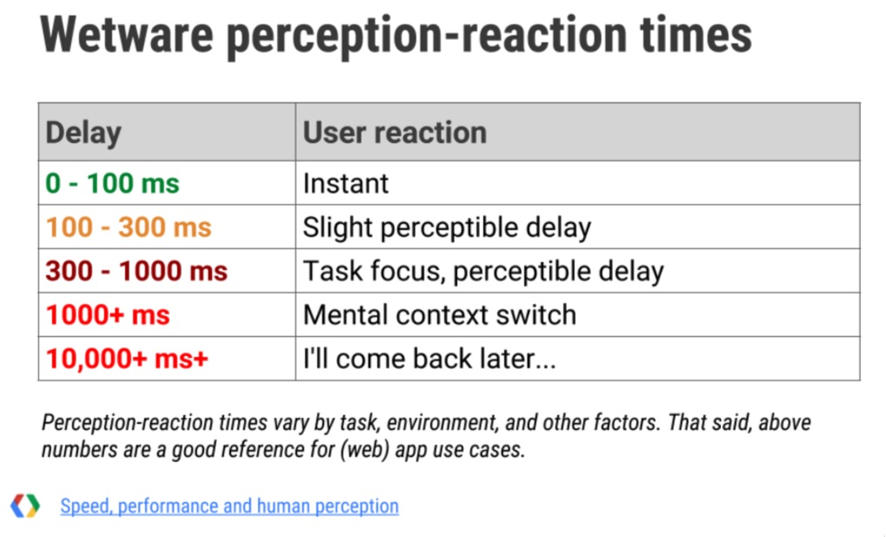
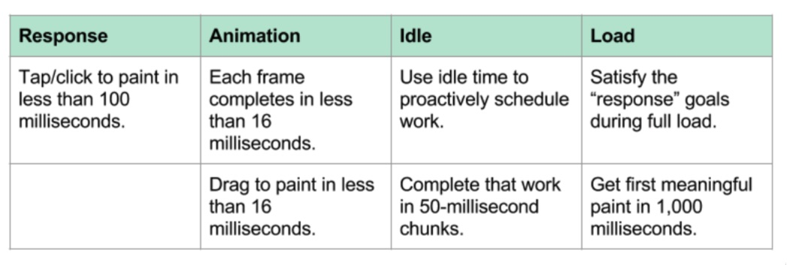

Disclaimer: We’re not going to obsess over numbers.

It’s about getting 10% better.

“Strategies for Optimizing Web Performance When, Honestly, You Have Like 5 Meetings Today and You Need to Choose the Correct Hills Upon Which to Strategically Die” — Romeeka Gayhart, @CCandUC

Are all of our needs the same?
What matters to you?

- The New York Times might care about time to first headline.
- Twitter might care about time to first tweet. 
- Chrome might care about time to inspect element. 
- What does your product or project care about?

**[⬆ back to top](#table-of-contents)**

### The Importance of Measurement

Measure. Don’t tune for speed until you’ve measured, and even then don’t unless one part of the code overwhelms the rest. —Rob Pike

Do not go just blindly applying performance optimizations.

There is a cost to every abstraction —and everything has a trade off.

I’m not a fan of premature optimization, but performance is one of those things where if we’re not keeping an eye on it, it has a chance of getting away from us.

Some things to think about while measuring

- Are we testing performance on fancy MacBook Pros or consumer-grade hardware?
- Are we simulating less-than-perfect network conditions. 
- What is our performance budget?

Don’t get carried away with measuring, either.

Thinking deeply about the architecture and design of your application is a better use of your time than micro-benchmarks.

Three Tiers of Advice

- Definitely do this.
- Maybe do this, but measure before and after.
- Only do this if you find a performance problem that needs solving.

And now: Steve’s Golden Rule of Performance

- Doing Less Stuff Takes Less Time.
- If you can do it later. Do it later.

Rough Outline

- JavaScript performance: Write code that runs faster, later, or not at all.
- Rendering performance: It turns out most of our JavaScript happens in the browser, which has its own performance concerns.
- Load performance: Until the user actually gets the page, there isn’t much to optimize.

**[⬆ back to top](#table-of-contents)**

## **02. JavaScript Performance**

### The Cost of JavaScript

Problem: You literally can’t buy faster servers to improve performance of client-side applications.

I mean, you could buy all of your customers faster computers, I guess.🤑

A lot of time and energy is spent compressing assets, removing requests, and reducing latency, but what about once the application is running?

[JavaScript Bytes](https://httparchive.org/reports/state-of-javascript#bytesJs)

Sometimes, scripting (parsing and compiling) is the real culprit.

Okay, so how does JavaScript even work?

Fun fact: JavaScript is a compiled language.

Most browsers use something called just-in-time (JIT) compilation.

Things to know about JIT compilation

- It means that there is compilation step.
- It means that it happens moments before execution. 
- That means it happens on our client’s machine.
- That means they’re paying the cost and/or doing the hard work for us.

Let’s look at your code’s journey through V8 at a high level.

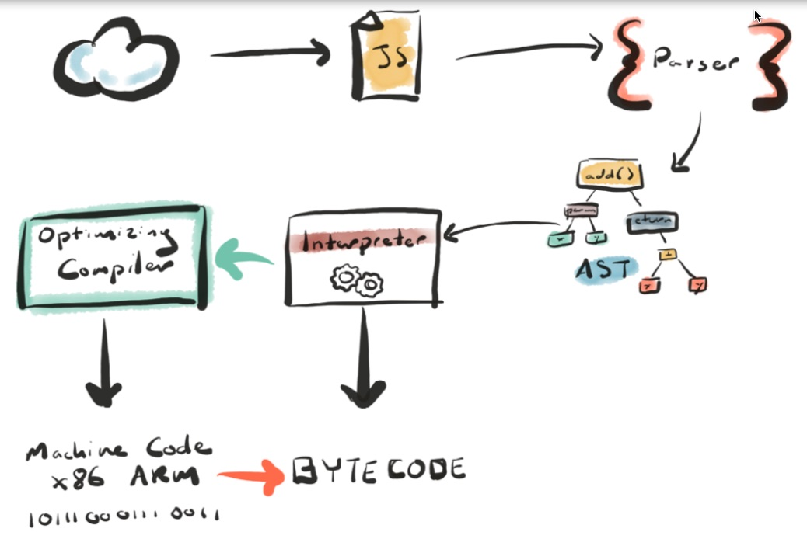

**[⬆ back to top](#table-of-contents)**

### Parsing

The source code is the true intention of the application, but the engine needs to figure out what this means.

Parsing can be slow. As slow as 1MB/s on mobile.

One way to reduce parsing time is to have less code to parse.

Another way is to do as much parsing as you need and as little as you can get away with.

Parsing happens in two phases

- Eager (full parse): This is what you think of when you think about parsing.
- Lazy (pre-parse): Do the bear minimum now. We’ll parse it for realsies later.

Generally speaking, Lazy Parsing is a good thing.

Doing less work is faster than doing work, right?

The basic rules

- Scan through the top-level scope. Parse all the code you see that’s actually doing something.
- Skip things like function declarations and classes for now. We’ll parse them when we need them.

This could bite you. But, how?

```javascript
// These will be eagerly-parsed.
const a = 1;
const b = 2;
// Take note that there a function here,
// but, we'll parse the body when we need it.
function add(a, b) {
  return a + b;
}
add(a, b);   // Whoa. Go back and parse add()!
```

Do you see the problem here?

Corollary: Doing stuff twice is slower than doing it once.

```javascript
const a = 1;
const b = 2;
// Parse it now!
(function add(a, b) {
return a + b;
});
add(a, b);
```

It’s definitely helpful to know how this works, but...

micro-optimization (noun): Thing you read about one time and you know pester your co-works about in code reviews, even though it has an almost unnoticeable impact at scale.

“But, Steve! These little things add up!” — Me (pretending to be you), just now.

**[⬆ back to top](#table-of-contents)**

### Reducing Parsing Times Exercise

- And now: An exploration of why measuring is important.
- Lab: [Test optimize-js](https://nolanlawson.github.io/test-optimize-js)
- [optimize-js](https://github.com/nolanlawson/optimize-js)
- [optimize-js-plugin](https://github.com/vigneshshanmugam/optimize-js-plugin)

```javascript
const doSomething = (a, b) => a + b;
const start = performance.now();
doSomething(1, 2);
const end = performance.now();
console.log(`Call to doSomething took ${end - start} ms.`);
```

**[⬆ back to top](#table-of-contents)**

### Reducing Parsing Times Solution

Try to avoid nested functions

```javascript
function sumOfSquares(x, y) {
  // 👇 This will repeatedly be parsed.
  function square(n) {
    return n * n;
  }

  return square(x) + square(y);
}
```

Better...

```javascript
function square(n) {
  return n * n;
}

function sumOfSquares(x, y) {
  return square(x) + square(y);
}
```

**[⬆ back to top](#table-of-contents)**

### ASTs and Initial Execution

Okay, cool—so it’s parsed. Now what?

It’s turned into an abstract syntax tree.

In computer science, an abstract syntax tree (AST) [...] is a tree representation of the abstract syntactic structure of source code written in a programming language. — Wikipedia

Essential, we’ve gone from a big long string of text to an actual data structure representing our code.

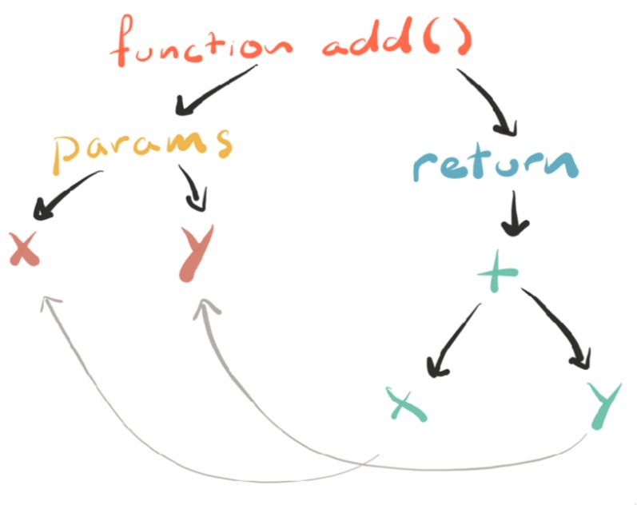

With our AST, we now have everything we need to make byte code!

The baseline compiler takes the AST and starts to execute our code as we wrote it.

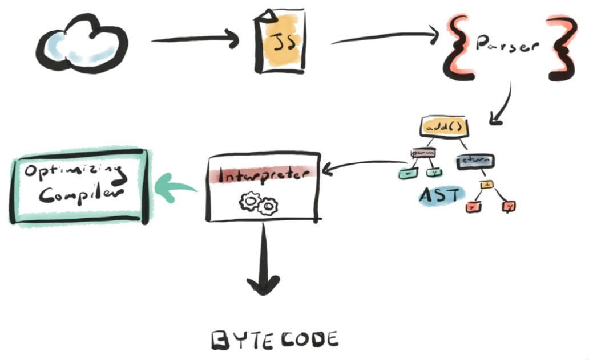

**[⬆ back to top](#table-of-contents)**

### The Optimizing Compiler

Three things the engine does to help you out

- Speculative optimization
- Hidden classes for dynamic lookups 
- Function inlining

It turns out that JavaScript is hard.

It also turns out that JavaScript is dynamic.

But, what if we made some assumptions based on what we’ve seen in the past?

Play Time

- [Web Performance API](https://developer.mozilla.org/en-US/docs/Web/API/Performance_API)
- [User Timing API](https://developer.mozilla.org/en-US/docs/Web/API/User_Timing_API)
- [Node JS Performance hooks](https://nodejs.org/api/perf_hooks.html)

```javascript
// benchmarks/benchmark.js
function add(a, b) {
  return x + y;
}
```

Play with Node JS

```console
node benchmark.js
node --trace-opt benchmark.js
node --trace-opt benchmark.js | grep add
```

Node JS Results

```
[marking 0x3a47fa172489 <JSFunction add (sfi = 0x3a474d28fed1)> for optimized recompilation, reason: small function]
[compiling method 0x3a47fa172489 <JSFunction add (sfi = 0x3a474d28fed1)> using TurboFan]
[optimizing 0x3a47fa172489 <JSFunction add (sfi = 0x3a474d28fed1)> - took 0.498, 0.765, 0.010 ms]
[completed optimizing 0x3a47fa172489 <JSFunction add (sfi = 0x3a474d28fed1)>]
```

Play with Chrome

- about:blank
- Performance Tab: record
- Paste benchmark.js code in console
- Performance Tab: stop

Chrome Results


**[⬆ back to top](#table-of-contents)**

### Deoptimization, Deleting Properties

```javascript
performance.mark('start');

while (iterations--) {
  add(a, b);
}

// deoptimizing take place 
// input parameter type change to string
add('foo', 'bar');

performance.mark('end');

// node --trace-opt --trace-deopt benchmark.js | grep add

// [marking 0x369c1c1d2771 <JSFunction add (sfi = 0x369cf41cff51)> for optimized recompilation, reason: small function]
// [compiling method 0x369c1c1d2771 <JSFunction add (sfi = 0x369cf41cff51)> using TurboFan]
// [optimizing 0x369c1c1d2771 <JSFunction add (sfi = 0x369cf41cff51)> - took 0.469, 0.630, 0.010 ms]
// [completed optimizing 0x369c1c1d2771 <JSFunction add (sfi = 0x369cf41cff51)>]
//      13: 0x369c1c1d2771 ; rcx 0x369c1c1d2771 <JSFunction add (sfi = 0x369cf41cff51)>
//     0x7ffeefbfeb30: [top +  56] <- 0x369c1c1d2771 <JSFunction add (sfi = 0x369cf41cff51)> ;  stack parameter (input #13)
// [deoptimizing (DEOPT eager): begin 0x369c1c1d2771 <JSFunction add (sfi = 0x369cf41cff51)> (opt #0) @0, FP to SP delta: 24, caller sp: 0x7ffeefbfeb00]
//   reading input frame add => bytecode_offset=0, args=3, height=0, retval=0(#0); inputs:
//       0: 0x369c1c1d2771 ;  [fp -  16]  0x369c1c1d2771 <JSFunction add (sfi = 0x369cf41cff51)>
//   translating interpreted frame add => bytecode_offset=0, variable_frame_size=8, frame_size=80
//     0x7ffeefbfeac8: [top +  24] <- 0x369c1c1d2771 <JSFunction add (sfi = 0x369cf41cff51)> ;  function (input #0)
// [deoptimizing (eager): end 0x369c1c1d2771 <JSFunction add (sfi = 0x369cf41cff51)> @0 => node=0, pc=0x0001008d69a0, caller sp=0x7ffeefbfeb00, took 0.307 ms]
```

```javascript
performance.mark('start');

while (iterations--) {
  add(a, b);
}

iterations = 1e7;

while (iterations--) {
  add(a, b);
}

performance.mark('end');

// node benchmark.js

// PerformanceEntry {
//   name: 'My Special Benchmark',
//   entryType: 'measure',
//   startTime: 39.5916,
//   duration: 21.089114
// }
```

```javascript
performance.mark('start');

while (iterations--) {
  add(a, b);
}

// deoptimizing take place
// duration double from 21 to 46 ms
add('foo', 'bar');
iterations = 1e7;

while (iterations--) {
  add(a, b);
}

performance.mark('end');

// node benchmark.js

// PerformanceEntry {
//   name: 'My Special Benchmark',
//   entryType: 'measure',
//   startTime: 40.72167,
//   duration: 46.01813
// }
```

```javascript
performance.mark('start');

%NeverOptimizeFunction(add)

while (iterations--) {
  add(a, b);
}

performance.mark('end');

// node --allow-natives-syntax benchmark.js

// PerformanceEntry {
//   name: 'My Special Benchmark',
//   entryType: 'measure',
//   startTime: 52.143221,
//   duration: 187.299235
// }
```

```javascript
function add(x, y) {
  return x + y;
}

add(1, 2);
%OptimizeFunctionOnNextCall(add);
add(3, 4);

// node --allow-natives-syntax --trace-opt add.js

// [manually marking 0x2fc021127049 <JSFunction add (sfi = 0x2fc04320fc11)> for non-concurrent optimization]
// [compiling method 0x2fc021127049 <JSFunction add (sfi = 0x2fc04320fc11)> using TurboFan]
// [optimizing 0x2fc021127049 <JSFunction add (sfi = 0x2fc04320fc11)> - took 0.553, 0.504, 0.023 ms]
```

We use a system called speculative optimization.

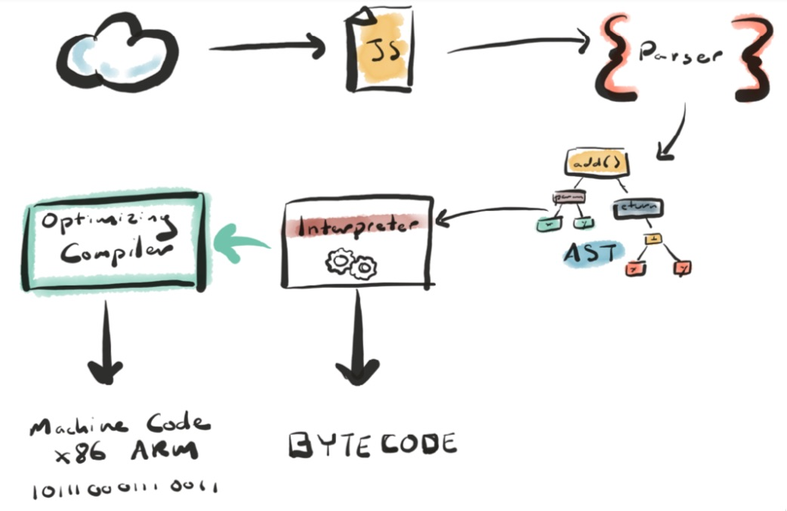

How does this work?

- We use an interpreter because the optimizing compiler is slow to get started.
- Also: it needs some information before it knows what work it can either optimize or skip out on all together.
- So, the interpreter starts gathering feedback about what it sees as the function is used.

But what if a string slips in there?

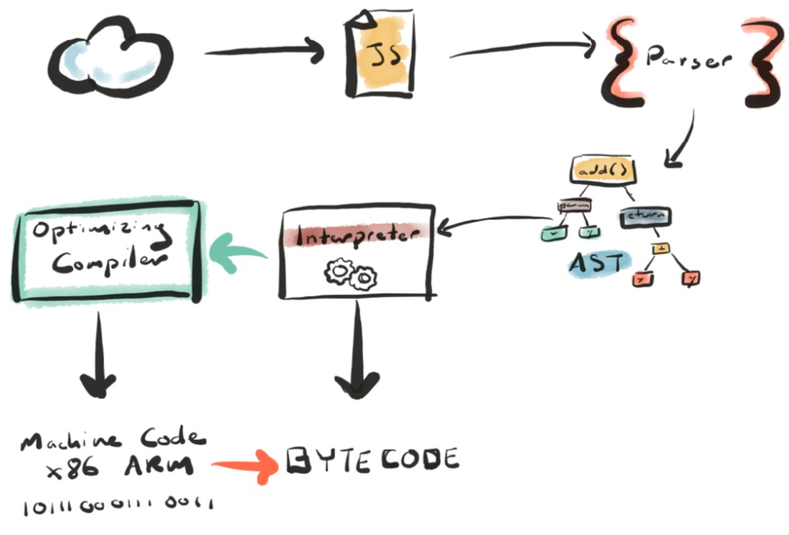

The optimizing compiler optimizes for what it’s seen. If it sees something new, that’s problematic.

- add(1, 2) -> optimize -> add('foo', 'bar') -> deoptimize -> add(1, 2) -> optimize

```javascript
let iterations = 1000000;

class Point {
  constructor(x, y) {
    this.x = x;
    this.y = y;
  }
}

performance.mark('start');

while (iterations--) {
  const point = new Point(2, 4);
  JSON.stringify(point);
}

performance.mark('end');

// node benchmark.js

// PerformanceEntry {
//   name: 'My Special Benchmark',
//   entryType: 'measure',
//   startTime: 43.541689,
//   duration: 350.737282
// }
```

```javascript
performance.mark('start');

while (iterations--) {
  const point = new Point(2, 4);
  delete point.x;
  JSON.stringify(point);
}

performance.mark('end');

// node benchmark.js

// PerformanceEntry {
//   name: 'My Special Benchmark',
//   entryType: 'measure',
//   startTime: 40.989665,
//   duration: 734.314327
// }
```

```javascript
performance.mark('start');

while (iterations--) {
  const point = new Point(2, 4);
  delete point.y;
  JSON.stringify(point);
}

performance.mark('end');

// node benchmark.js

// PerformanceEntry {
//   name: 'My Special Benchmark',
//   entryType: 'measure',
//   startTime: 39.196188,
//   duration: 355.132393
// }
```

Conclusion: 
- Delete point.x increase execution time to 3x
- Delete point.y don't affect the execution time

**[⬆ back to top](#table-of-contents)**

### Deleting, Feeding Objects Exercise

```javascript
let iterations = 1000000;

class Point {
  constructor(x, y, z) {
    this.x = x;
    this.y = y;
    this.z = z;
  }
}

performance.mark('start');

while (iterations--) {
  const point = new Point(2, 4, 6);
  delete point.x;
  delete point.y;
  delete point.z;

  JSON.stringify(point);
}

performance.mark('end');
```

**[⬆ back to top](#table-of-contents)**

### Deleting, Feeding Objects Solution

```javascript
performance.mark('start');

while (iterations--) {
  const point = new Point(2, 4, 6);
  delete point.x;

  JSON.stringify(point);
}

performance.mark('end');

// node benchmark.js 

// PerformanceEntry {
//   name: 'My Special Benchmark',
//   entryType: 'measure',
//   startTime: 47.241762,
//   duration: 851.268479
// }
```

```javascript
performance.mark('start');

while (iterations--) {
  const point = new Point(2, 4, 6);
  delete point.y;

  JSON.stringify(point);
}

performance.mark('end');

// node benchmark.js 

// PerformanceEntry {
//   name: 'My Special Benchmark',
//   entryType: 'measure',
//   startTime: 43.362006,
//   duration: 971.586343
// }
```

```javascript
performance.mark('start');

while (iterations--) {
  const point = new Point(2, 4, 6);
  delete point.z;

  JSON.stringify(point);
}

performance.mark('end');

// node benchmark.js 

// PerformanceEntry {
//   name: 'My Special Benchmark',
//   entryType: 'measure',
//   startTime: 42.095334,
//   duration: 389.110982
// }
```

Conclusion: 
- Delete point.x and point.y increase execution time to 3x
- Delete point.z don't affect the execution time
- Delete last property don't affect the execution time

**[⬆ back to top](#table-of-contents)**

### Monomorphism, Polymorphism, and Megamorphism

```javascript
let iterations = 1e7;
const objects = [{ a: 1 }, { a: 2 }, { a: 3 }, { a: 4 }]

performance.mark('start');

while (iterations--) {
  let sum = 0;
  const obj = objects[iterations & 3];
  sum = sum + obj.a;
}

performance.mark('end');

// node benchmark.js 

// PerformanceEntry {
//   name: 'My Special Benchmark',
//   entryType: 'measure',
//   startTime: 43.635845,
//   duration: 17.738028
// }
```

```javascript
let iterations = 1e7;
const objects = [{ a: 1 }, { b: 1, a: 2 }, { a: 3, c: 4, b: 2 }, { a: 4, b: 7 }]

performance.mark('start');

while (iterations--) {
  let sum = 0;
  const obj = objects[iterations & 3];
  sum = sum + obj.a;
}

performance.mark('end');

// node benchmark.js 

// PerformanceEntry {
//   name: 'My Special Benchmark',
//   entryType: 'measure',
//   startTime: 41.509887,
//   duration: 24.452353
// }
```

Conclusion

- 40% increase in execution time when change from monomorphic to polymorphic, degree 3
```javascript
// monomorphic
const objects = [{ a: 1 }, { a: 2 }, { a: 3 }, { a: 4 }]
// polymorphic, degree 3
const objects = [{ a: 1 }, { b: 1, a: 2 }, { a: 3, c: 4, b: 2 }, { a: 4, b: 7 }]
```

*–morphism.

- Monomorphic: This is all I know and all that I’ve seen. I can get incredibly fast at this one thing.
- Polymorphic: I’ve seen a few shapes before. Let me just check to see which one and then I’ll go do the fast thing.
- Megamorphic: I’ve seen things. A lot of things. I’m not particularly specialized. Sorry.

So, how does the browser figure out what type something is?

- [JavaScript engine fundamentals: Shapes and Inline Caches](https://mathiasbynens.be/notes/shapes-ics)
- [What's up with monomorphism?](https://mrale.ph/blog/2015/01/11/whats-up-with-monomorphism.html)
- [V8 function optimization](https://erdem.pl/2019/08/v-8-function-optimization)
- [A Tour of Inline Caching with Delete](https://webkit.org/blog/10298/inline-caching-delete/)

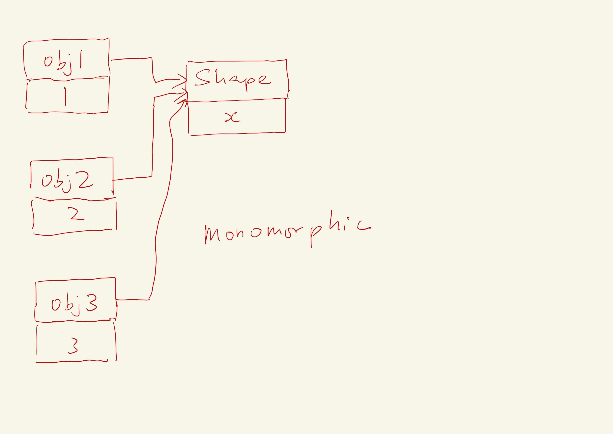
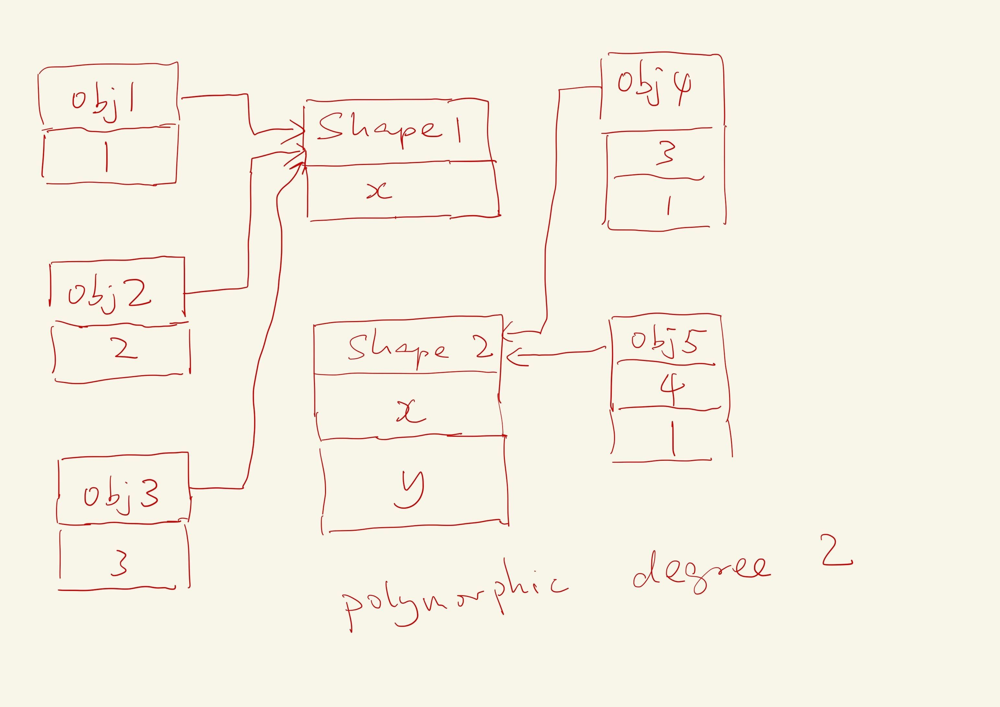
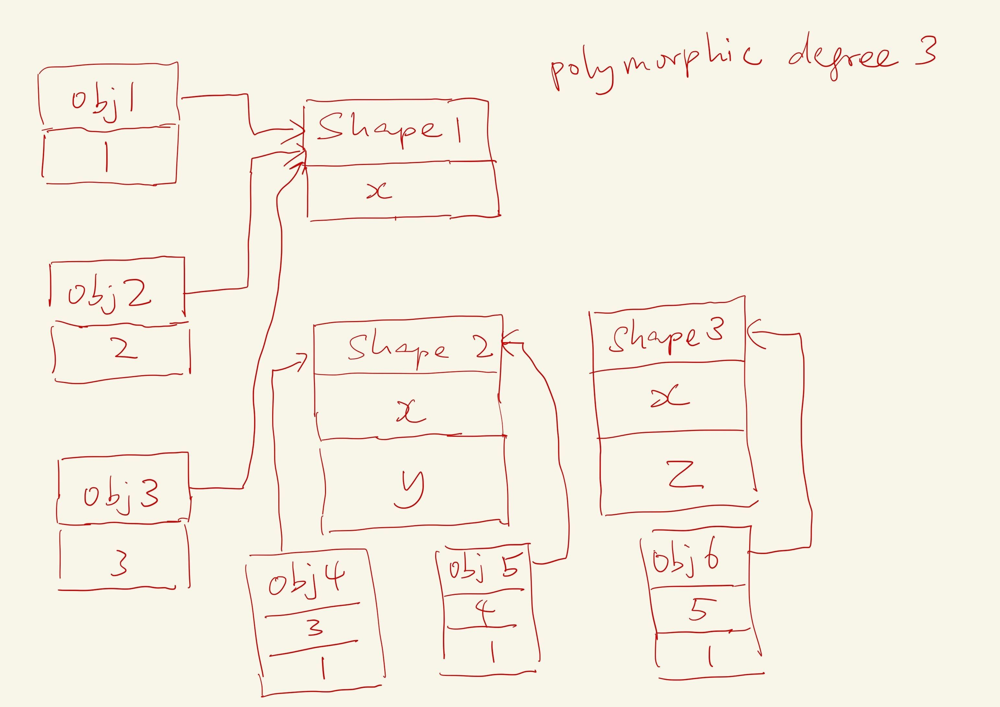
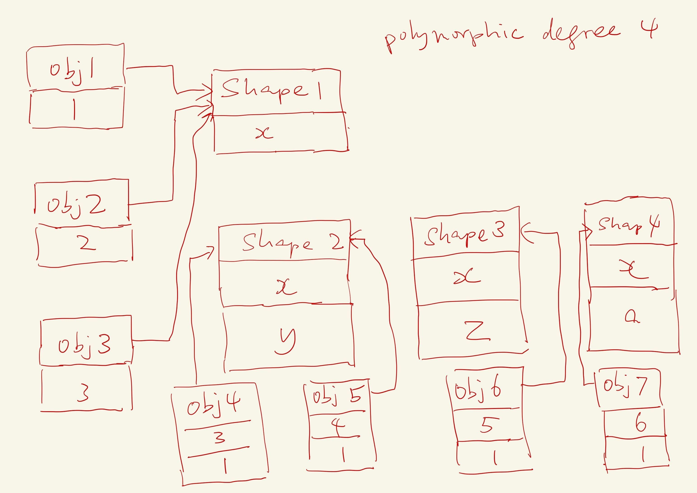
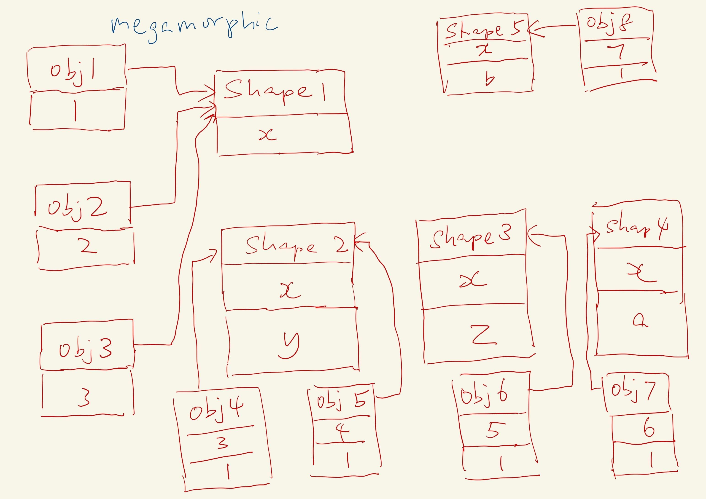

```javascript
const obj1 = { x: 1 };  // monomorphic
const obj2 = { x: 2 };  // monomorphic
const obj3 = { x: 3 };  // monomorphic
const obj4 = { x: 3, y: 1 }; // polymorphic, degree 2
const obj5 = { x: 4, y: 1 }; // polymorphic, degree 2
const obj6 = { x: 5, z: 1 }; // polymorphic, degree 3
const obj7 = { x: 6, a: 1 }; // polymorphic, degree 4
const obj8 = { x: 7, b: 1 }; // megamorphic
```

Conclusion

- keep object shape to monomorphic [mono- ("one") + -morphic ("of a form")]

**[⬆ back to top](#table-of-contents)**

### Optimizing Objects

```javascript
const a = { a: 1 };
const b = { b: 1 };
console.log(%HaveSameMap(a, b));
// node --allow-natives-syntax classes.js
// false

const a = { a: 1 };
const b = { a: 1 };
console.log(%HaveSameMap(a, b));
// node --allow-natives-syntax classes.js
// true

const a = { a: 1, x: 3 };
const b = { a: 2 };
console.log(%HaveSameMap(a, b));
// node --allow-natives-syntax classes.js
// false

const a = { a: 1, x: 3 };
const b = { a: 2, x: 4 };
console.log(%HaveSameMap(a, b));
// node --allow-natives-syntax classes.js
// true

const a = { a: 1, x: 3 };
const b = { a: 2 };
b.x = 4;
console.log(%HaveSameMap(a, b));
// node --allow-natives-syntax classes.js
// false

const a = { a: 1 };
const b = { a: 2 };
a.x = 3;
b.x = 4;
console.log(%HaveSameMap(a, b));
// node --allow-natives-syntax classes.js
// true

const a = { a: 1 };
const b = Object.assign({}, a);
console.log(%HaveSameMap(a, b));
// node --allow-natives-syntax classes.js
// false

const a = { a: 1 };
const b = Object.assign({}, a);
const c = Object.assign({}, a);
console.log(%HaveSameMap(b, c));
// node --allow-natives-syntax classes.js
// true

class Point {
  constructor(x, y) {
    this.x = x;
    this.y = y;
  }
}
const a = new Point(1, 2);
const b = new Point(3, 4);
console.log(%HaveSameMap(a, b));
// node --allow-natives-syntax classes.js
// true
```

**[⬆ back to top](#table-of-contents)**

### Hidden Classes

Dynamic lookup: This object could be anything, so let me look at the rule book and figure this out.

Sure, computers are good at looking stuff up repeatedly, but they’re also good at remembering things.

It turns out there is a secret type system behind your back.

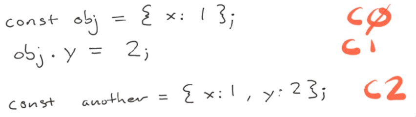

You can only move forward along the chain.

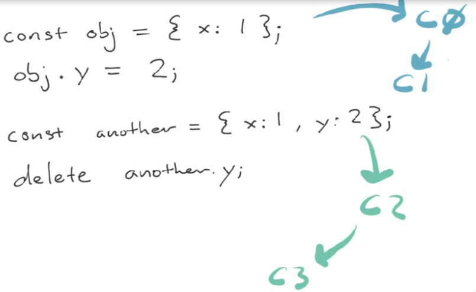

Okay, let’s look at this again with some real code.

**[⬆ back to top](#table-of-contents)**

### Scoping and Prototypes

```javascript
let iterations = 100000;

const test = () => {
  const add = point => point.x + point.y;
  class Point {
    constructor(x, y) {
      this.x = x;
      this.y = y;
    }
  }
  const point = new Point(10, 20);
  add(point);
};

performance.mark('start');

while (iterations--) {
  test();
}

performance.mark('end');

// node benchmark.js 
// PerformanceEntry {
//   name: 'My Special Benchmark',
//   entryType: 'measure',
//   startTime: 43.316833,
//   duration: 528.249334
// }
```

```javascript
let iterations = 100000;
class Point {
  constructor(x, y) {
    this.x = x;
    this.y = y;
  }
}

const test = () => {
  const add = point => point.x + point.y;
  const point = new Point(10, 20);
  add(point);
};

performance.mark('start');

while (iterations--) {
  test();
}

performance.mark('end');

// node benchmark.js 
// PerformanceEntry {
//   name: 'My Special Benchmark',
//   entryType: 'measure',
//   startTime: 41.143181,
//   duration: 6.36401
// }
```

Conclusion

- Must Point class out of test function results in 83x faster in execution.
- Why? See below code
- If Point class is inside the function makeAPoint, we are making this class as a different prototype chain every time.
- Each one of these output points point to a different type object when we make a fresh point function every time.

```javascript
const makeAPoint = () => {
  class Point {
    constructor(x, y) {
      this.x = x;
      this.y = y;
    }
  }
  return new Point(1, 2);
}

const a = makeAPoint();
const b = makeAPoint();
console.log(%HaveSameMap(a, b));
// node --allow-natives-syntax classes.js
// false
```
Takeaways

- Turbofan is able to optimize your code in substantial ways if you pass it consistent values.
- Initialize your properties at creation. 
- Initialize them in the same order.
- Try not to modify them after the fact.
- Maybe just use TypeScript or Flow so you don’t have to worry about these things?

**[⬆ back to top](#table-of-contents)**

### Function Inlining

Inline function
```javascript
const square = x => x * x;
const sumOfSquare = (a, b) => square(a) + square(b);
```

```javascript
let iterations = 100000;

const square = x => x * x;
const sumOfSquare = (a, b) => square(a) + square(b);

performance.mark('start');

while (iterations--) {
  sumOfSquare(iterations, iterations + 1);
}

performance.mark('end');

// node benchmark.js 
// PerformanceEntry {
//   name: 'My Special Benchmark',
//   entryType: 'measure',
//   startTime: 47.126163,
//   duration: 4.538562
// }
```

```javascript
let iterations = 100000;

const square = x => x * x;
const sumOfSquare = (a, b) => a * a + b * b;

performance.mark('start');

while (iterations--) {
  sumOfSquare(iterations, iterations + 1);
}

performance.mark('end');

// node benchmark.js 
// PerformanceEntry {
//   name: 'My Special Benchmark',
//   entryType: 'measure',
//   startTime: 42.331587,
//   duration: 3.977038
// }
```

```javascript
let iterations = 100000;

const square = x => x * x;
const sumOfSquare = (a, b) => square(a) + square(b);

performance.mark('start');

while (iterations--) {
  sumOfSquare(iterations, iterations + 1);
}

performance.mark('end');

// node --trace-turbo-inlining benchmark.js 
// 0x31ea001cff01 <SharedFunctionInfo square>: IsInlineable? true
// Inlining small function(s) at call site #29:JSCall
// Inlining 0x1040421b0 {0x31ea001cff01 <SharedFunctionInfo square>} into 0x10402b878 {0x31ea001cff51 <SharedFunctionInfo sumOfSquare>}
// 0x31ea001cff01 <SharedFunctionInfo square>: IsInlineable? true
// Inlining small function(s) at call site #43:JSCall
// Inlining 0x1040421b0 {0x31ea001cff01 <SharedFunctionInfo square>} into 0x10402b878 {0x31ea001cff51 <SharedFunctionInfo sumOfSquare>}
// 0x31eafcf49489 <SharedFunctionInfo Array>: IsInlineable? false (no Script associated with it)
// 0x31eafcf4a369 <SharedFunctionInfo Boolean>: IsInlineable? false (no Script associated with it)
// 0x31eafcf51f01 <SharedFunctionInfo BigInt>: IsInlineable? false (no Script associated with it)
// 0x31eafcf49f91 <SharedFunctionInfo Number>: IsInlineable? false (no Script associated with it)
// 0x31eafcf483e1 <SharedFunctionInfo Object>: IsInlineable? false (no Script associated with it)
// 0x31eafcf4c539 <SharedFunctionInfo Promise>: IsInlineable? false (no Script associated with it)
// 0x31eafcf4c6f9 <SharedFunctionInfo then>: IsInlineable? false (no Script associated with it)
// 0x31eafcf4a411 <SharedFunctionInfo String>: IsInlineable? false (no Script associated with it)
// 0x31eafcf4b2f1 <SharedFunctionInfo Symbol>: IsInlineable? false (no Script associated with it)
// 0x31eafcf4c921 <SharedFunctionInfo>: IsInlineable? false (no Script associated with it)
// 0x31eafcf4c809 <SharedFunctionInfo>: IsInlineable? false (no Script associated with it)
// 0x31eafcf4c7d1 <SharedFunctionInfo>: IsInlineable? false (no Script associated with it)
// 0x31eafcf4c8e9 <SharedFunctionInfo>: IsInlineable? false (no Script associated with it)
// 0x31eafcf4c9c9 <SharedFunctionInfo exec>: IsInlineable? false (no Script associated with it)
// 0x31ea001cff01 <SharedFunctionInfo square>: IsInlineable? true
// 0x31ea001cff51 <SharedFunctionInfo sumOfSquare>: IsInlineable? true
// 0x31ea001cff51 <SharedFunctionInfo sumOfSquare>: IsInlineable? true
// Inlining small function(s) at call site #54:JSCall
// Inlining 0x10481ceb8 {0x31ea001cff51 <SharedFunctionInfo sumOfSquare>} into 0x104814890 {0x31ea001cfde9 <SharedFunctionInfo>}
// 0x31ea001cff01 <SharedFunctionInfo square>: IsInlineable? true
// Inlining small function(s) at call site #91:JSCall
// Inlining 0x10481ea00 {0x31ea001cff01 <SharedFunctionInfo square>} into 0x104814890 {0x31ea001cfde9 <SharedFunctionInfo>}
// 0x31ea001cff01 <SharedFunctionInfo square>: IsInlineable? true
// Inlining small function(s) at call site #105:JSCall
// Inlining 0x10481ea00 {0x31ea001cff01 <SharedFunctionInfo square>} into 0x104814890 {0x31ea001cfde9 <SharedFunctionInfo>}
// 0x31eafcf49489 <SharedFunctionInfo Array>: IsInlineable? false (no Script associated with it)
// 0x31eafcf4a369 <SharedFunctionInfo Boolean>: IsInlineable? false (no Script associated with it)
// 0x31eafcf51f01 <SharedFunctionInfo BigInt>: IsInlineable? false (no Script associated with it)
// 0x31eafcf49f91 <SharedFunctionInfo Number>: IsInlineable? false (no Script associated with it)
// 0x31eafcf483e1 <SharedFunctionInfo Object>: IsInlineable? false (no Script associated with it)
// 0x31eafcf4c539 <SharedFunctionInfo Promise>: IsInlineable? false (no Script associated with it)
// 0x31eafcf4c6f9 <SharedFunctionInfo then>: IsInlineable? false (no Script associated with it)
// 0x31eafcf4a411 <SharedFunctionInfo String>: IsInlineable? false (no Script associated with it)
// 0x31eafcf4b2f1 <SharedFunctionInfo Symbol>: IsInlineable? false (no Script associated with it)
// (base) Chesters-MacBook-Pro:benchmarks chesterheng$ node --trace-turbo-inlining benchmark.js 
// 0x3372a2bcff01 <SharedFunctionInfo square>: IsInlineable? true
// Inlining small function(s) at call site #29:JSCall
// Inlining 0x1048599b0 {0x3372a2bcff01 <SharedFunctionInfo square>} into 0x10484b678 {0x3372a2bcff51 <SharedFunctionInfo sumOfSquare>}
// 0x3372a2bcff01 <SharedFunctionInfo square>: IsInlineable? true
// Inlining small function(s) at call site #43:JSCall
// Inlining 0x1048599b0 {0x3372a2bcff01 <SharedFunctionInfo square>} into 0x10484b678 {0x3372a2bcff51 <SharedFunctionInfo sumOfSquare>}
// 0x337265a09489 <SharedFunctionInfo Array>: IsInlineable? false (no Script associated with it)
// 0x337265a0a369 <SharedFunctionInfo Boolean>: IsInlineable? false (no Script associated with it)
// 0x337265a11f01 <SharedFunctionInfo BigInt>: IsInlineable? false (no Script associated with it)
// 0x337265a09f91 <SharedFunctionInfo Number>: IsInlineable? false (no Script associated with it)
// 0x337265a083e1 <SharedFunctionInfo Object>: IsInlineable? false (no Script associated with it)
// 0x337265a0c539 <SharedFunctionInfo Promise>: IsInlineable? false (no Script associated with it)
// 0x337265a0c6f9 <SharedFunctionInfo then>: IsInlineable? false (no Script associated with it)
// 0x337265a0a411 <SharedFunctionInfo String>: IsInlineable? false (no Script associated with it)
// 0x337265a0b2f1 <SharedFunctionInfo Symbol>: IsInlineable? false (no Script associated with it)
// 0x337265a0c921 <SharedFunctionInfo>: IsInlineable? false (no Script associated with it)
// 0x337265a0c809 <SharedFunctionInfo>: IsInlineable? false (no Script associated with it)
// 0x337265a0c7d1 <SharedFunctionInfo>: IsInlineable? false (no Script associated with it)
// 0x337265a0c8e9 <SharedFunctionInfo>: IsInlineable? false (no Script associated with it)
// 0x337265a0c9c9 <SharedFunctionInfo exec>: IsInlineable? false (no Script associated with it)
// 0x3372a2bcff01 <SharedFunctionInfo square>: IsInlineable? true
// 0x3372a2bcff51 <SharedFunctionInfo sumOfSquare>: IsInlineable? true
// 0x3372a2bcff51 <SharedFunctionInfo sumOfSquare>: IsInlineable? true
// Inlining small function(s) at call site #54:JSCall
// Inlining 0x10485b6b8 {0x3372a2bcff51 <SharedFunctionInfo sumOfSquare>} into 0x10484b690 {0x3372a2bcfde9 <SharedFunctionInfo>}
// 0x3372a2bcff01 <SharedFunctionInfo square>: IsInlineable? true
// Inlining small function(s) at call site #91:JSCall
// Inlining 0x10485d200 {0x3372a2bcff01 <SharedFunctionInfo square>} into 0x10484b690 {0x3372a2bcfde9 <SharedFunctionInfo>}
// 0x3372a2bcff01 <SharedFunctionInfo square>: IsInlineable? true
// Inlining small function(s) at call site #105:JSCall
// Inlining 0x10485d200 {0x3372a2bcff01 <SharedFunctionInfo square>} into 0x10484b690 {0x3372a2bcfde9 <SharedFunctionInfo>}
// 0x337265a09489 <SharedFunctionInfo Array>: IsInlineable? false (no Script associated with it)
// 0x337265a0a369 <SharedFunctionInfo Boolean>: IsInlineable? false (no Script associated with it)
// 0x337265a11f01 <SharedFunctionInfo BigInt>: IsInlineable? false (no Script associated with it)
// 0x337265a09f91 <SharedFunctionInfo Number>: IsInlineable? false (no Script associated with it)
// 0x337265a083e1 <SharedFunctionInfo Object>: IsInlineable? false (no Script associated with it)
// 0x337265a0c539 <SharedFunctionInfo Promise>: IsInlineable? false (no Script associated with it)
// 0x337265a0c6f9 <SharedFunctionInfo then>: IsInlineable? false (no Script associated with it)
// 0x337265a0a411 <SharedFunctionInfo String>: IsInlineable? false (no Script associated with it)
// 0x337265a0b2f1 <SharedFunctionInfo Symbol>: IsInlineable? false (no Script associated with it)
// 0x337265a0c921 <SharedFunctionInfo>: IsInlineable? false (no Script associated with it)
// 0x337265a0c809 <SharedFunctionInfo>: IsInlineable? false (no Script associated with it)
// 0x337265a0c7d1 <SharedFunctionInfo>: IsInlineable? false (no Script associated with it)
// 0x337265a0c8e9 <SharedFunctionInfo>: IsInlineable? false (no Script associated with it)
// 0x337265a0c9c9 <SharedFunctionInfo exec>: IsInlineable? false (no Script associated with it)
// 0x3372a2bcff01 <SharedFunctionInfo square>: IsInlineable? true
// 0x3372a2bcfde9 <SharedFunctionInfo>: IsInlineable? true
// 0x3372a2bcff51 <SharedFunctionInfo sumOfSquare>: IsInlineable? true
// PerformanceEntry {
//   name: 'My Special Benchmark',
//   entryType: 'measure',
//   startTime: 50.797892,
//   duration: 9.871933
// }
```

**[⬆ back to top](#table-of-contents)**

### JavaScript Performance Takeaways

- The easiest way to reduce parse, compile, and execution times is to ship less code.
- Use the User Timing API to figure out where the biggest amount of hurt is.
- Consider using a type system so that you don’t have to think about all of the stuff I just talked about.

**[⬆ back to top](#table-of-contents)**

## **03. Rendering Performance**

### How Web Pages Are Built


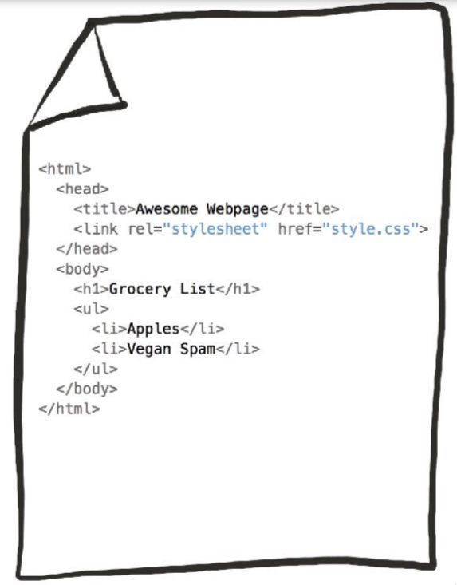
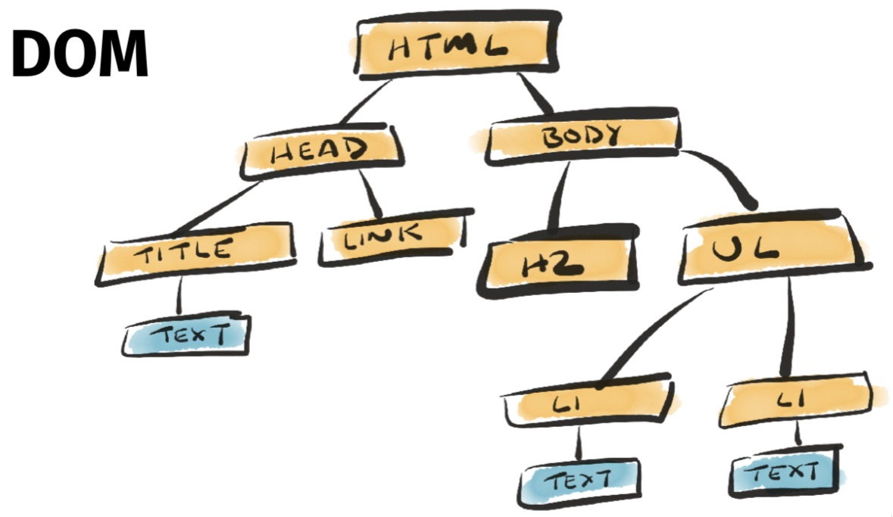
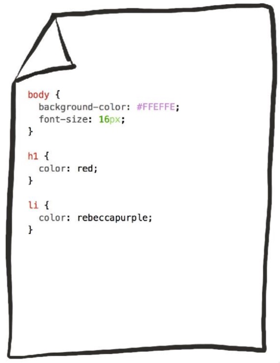
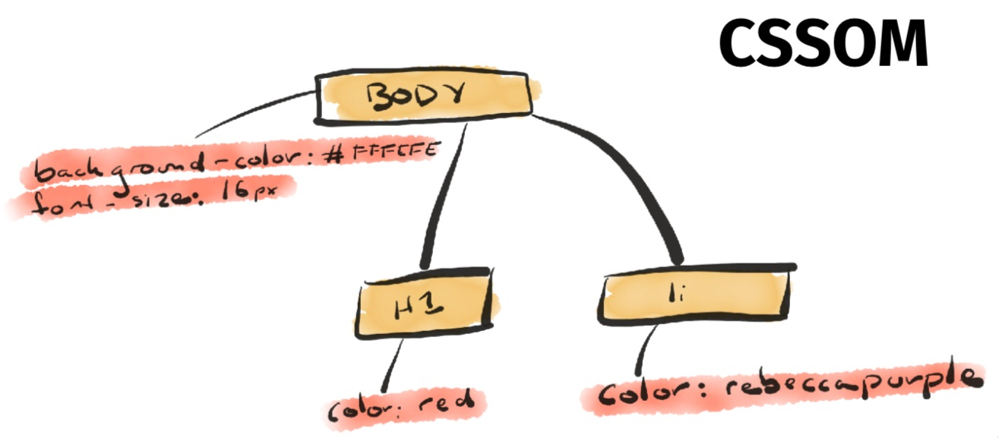
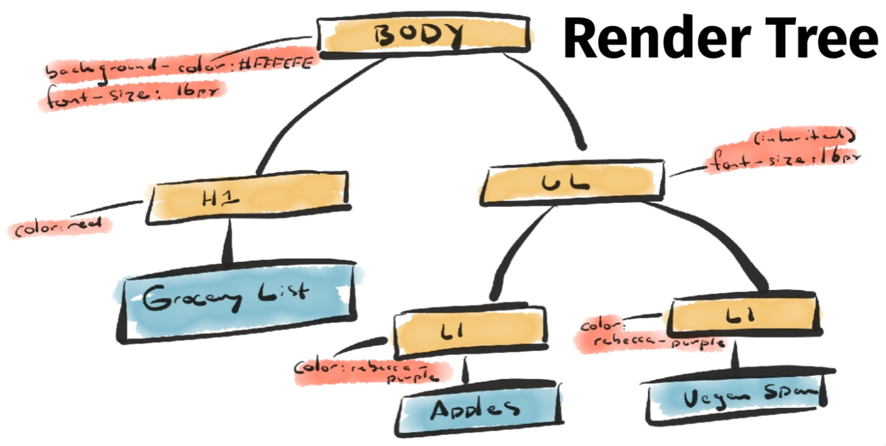

The Render Tree

- The Render Tree has a one-to-one mapping with the visible objects on the page.
  - So, not hidden object.
  - Yes, to pseudo elements (e.g. :after, :before).
- There might be multiple rules that apply to a single element. We need to figure that all out here.

Style calculation: The browser figures out all of the styles that will be applied to a given element.

This involves two things:

- Figuring out which rules apply to which elements.
- Figuring out how what the end result of an element with multiple rules is.

Styling Elements: Selector Matching

- This is the process of figuring out what styles apply to an element.
- The more complicated you get, the longer this takes.
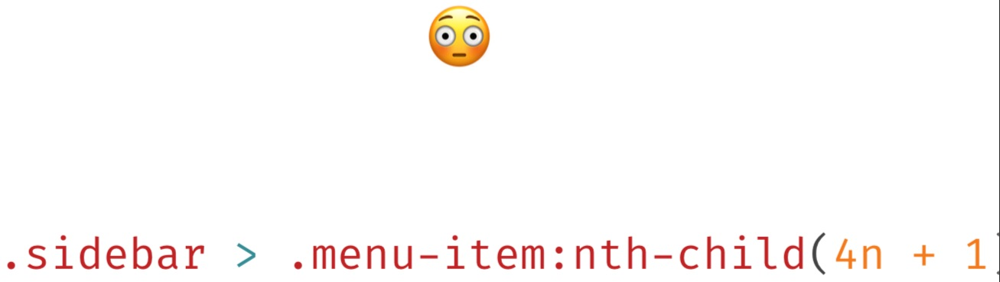
- Class names are super simple.
- Free Advice: Stick to simple class names whenever possible. Consider using BEM.
- Browsers read selectors from right to left.
- The less selectors you use, this faster this is going to be.

Takeaways

- Use simple selectors whenever possible.
  - Consider using BEM or some other system.
- Reduce the effected elements.
  - This is really a way to get to the first one.
  - A little bit of code—either on the server or the client— can go a long way.

Styling Elements: Calculating Render Styles

- Selector matching tries to figure out what selectors apply to an element.
- When multiple selectors apply to an element. The browser needs to figure out who wins.
- The easiest way to make this faster is to not do it.
- Free Advice (again): Stick to simple class names whenever possible. Consider using BEM.
- A quick note on style invalidation: It doesn’t matter as much in newer browsers.

Some Takeaways

- Reduce the number of styles that effect a given element.
- The less styles you have, the less there is to check.
- Reduce the amount of unused CSS that you’re shipping.

Layout (a.k.a Reflow): Look at the elements and figure out where they go on the page.

Paint: We know what things should look like and where they should go. Draw some pixels to the screen.

Composite Layers: You might end up painting on multiple layers, but you’ll eventually need to combine them.

Profit. 💸

**[⬆ back to top](#table-of-contents)**

### JavaScript and the Render Pipeline
**[⬆ back to top](#table-of-contents)**

### Layouts and Reflows
**[⬆ back to top](#table-of-contents)**

### Layouts and Reflows Exercise
**[⬆ back to top](#table-of-contents)**

### Layouts and Reflows Solution
**[⬆ back to top](#table-of-contents)**

### Layout Thrashing
**[⬆ back to top](#table-of-contents)**

### Solving for Layout Trashing
**[⬆ back to top](#table-of-contents)**

### FastDOM
**[⬆ back to top](#table-of-contents)**

### FastDOM Exercise
**[⬆ back to top](#table-of-contents)**

### FastDOM Solution
**[⬆ back to top](#table-of-contents)**

### Frameworks and Layout Thrashing
**[⬆ back to top](#table-of-contents)**

### Painting
**[⬆ back to top](#table-of-contents)**

### The Compositor Thread
**[⬆ back to top](#table-of-contents)**

### Managing Layers
**[⬆ back to top](#table-of-contents)**

### will-change
**[⬆ back to top](#table-of-contents)**

### Applying will-change with JavaScript
**[⬆ back to top](#table-of-contents)**

### will-change Exercise
**[⬆ back to top](#table-of-contents)**

### will-change Solution
**[⬆ back to top](#table-of-contents)**

## **04. Load Performance**
**[⬆ back to top](#table-of-contents)**

## **05. Tools**
**[⬆ back to top](#table-of-contents)**

## **06. Wrapping Up**
**[⬆ back to top](#table-of-contents)**
