# Web Performance

## Table of Contents

- [Web Performance](#web-performance)
  - [Table of Contents](#table-of-contents)
  - [**01. Introduction**](#01-introduction)
    - [Thinking About Performance](#thinking-about-performance)
      - [Why does performance matter?](#why-does-performance-matter)
      - [What is performance?](#what-is-performance)
    - [The Importance of Measurement](#the-importance-of-measurement)
  - [**02. JavaScript Performance**](#02-javascript-performance)
    - [The Cost of JavaScript](#the-cost-of-javascript)
    - [Parsing](#parsing)
    - [Reducing Parsing Times Exercise](#reducing-parsing-times-exercise)
    - [Reducing Parsing Times Solution](#reducing-parsing-times-solution)
    - [ASTs and Initial Execution](#asts-and-initial-execution)
    - [The Optimizing Compiler](#the-optimizing-compiler)
    - [Deoptimization, Deleting Properties](#deoptimization-deleting-properties)
    - [Deleting, Feeding Objects Exercise](#deleting-feeding-objects-exercise)
    - [Deleting, Feeding Objects Solution](#deleting-feeding-objects-solution)
    - [Monomorphism, Polymorphism, and Megamorphism](#monomorphism-polymorphism-and-megamorphism)
    - [Optimizing Objects](#optimizing-objects)
    - [Hidden Classes](#hidden-classes)
    - [Scoping and Prototypes](#scoping-and-prototypes)
    - [Function Inlining](#function-inlining)
    - [JavaScript Performance Takeaways](#javascript-performance-takeaways)
  - [**03. Rendering Performance**](#03-rendering-performance)
    - [How Web Pages Are Built](#how-web-pages-are-built)
    - [JavaScript and the Render Pipeline](#javascript-and-the-render-pipeline)
    - [Layouts and Reflows](#layouts-and-reflows)
    - [Layouts and Reflows Exercise](#layouts-and-reflows-exercise)
    - [Layouts and Reflows Solution](#layouts-and-reflows-solution)
    - [Layout Thrashing](#layout-thrashing)
    - [Solving for Layout Trashing](#solving-for-layout-trashing)
    - [FastDOM](#fastdom)
    - [FastDOM Exercise](#fastdom-exercise)
    - [FastDOM Solution](#fastdom-solution)
    - [Frameworks and Layout Thrashing](#frameworks-and-layout-thrashing)
    - [Painting](#painting)
    - [The Compositor Thread](#the-compositor-thread)
    - [Managing Layers](#managing-layers)
    - [will-change](#will-change)
    - [Applying will-change with JavaScript](#applying-will-change-with-javascript)
    - [will-change Exercise](#will-change-exercise)
    - [will-change Solution](#will-change-solution)
  - [**04. Load Performance**](#04-load-performance)
    - [Latency and Bandwidth](#latency-and-bandwidth)
    - [Caching](#caching)
    - [Service Workers](#service-workers)
    - [Lazy Loading](#lazy-loading)
    - [Lazy Loading Demonstrations](#lazy-loading-demonstrations)
    - [Analyzing Bundle Sizes](#analyzing-bundle-sizes)
    - [Slimming Dependencies](#slimming-dependencies)
    - [Lazy Loading components with React-Loadable](#lazy-loading-components-with-react-loadable)
    - [Component Lazy Loading Exercise](#component-lazy-loading-exercise)
    - [Component Lazy Loading Solution](#component-lazy-loading-solution)
    - [HTTP/2](#http2)
  - [**05. Tools**](#05-tools)
  - [**06. Wrapping Up**](#06-wrapping-up)

## **01. Introduction**

[Web Performance Slides](https://speakerdeck.com/stevekinney/web-performance)
[Course Notes and Materials](https://gist.github.com/stevekinney/fe401ffb8b2b7279e56dd165b272f0c3)

### Thinking About Performance

#### Why does performance matter?

0.1 second is about the limit for having the user feel that the system is reacting instantaneously, meaning that no special feedback is necessary except to display the result. —Jakob Nielsen

1.0 second is about the limit for the user's flow of thought to stay uninterrupted, even though the user will notice the delay. Normally, no special feedback is necessary during delays of more than 0.1 but less than 1.0 second, but the user does lose the feeling of operating directly on the data. —Jakob Nielsen

10 seconds is about the limit for keeping the user's attention focused on the dialogue. For longer delays, users will want to perform other tasks while waiting for the computer to finish, so they should be given feedback indicating when the computer expects to be done. Feedback during the delay is especially important if the response time is likely to be highly variable, since users will then

If your user interface takes 10 seconds or more to respond to an interaction, then we should talk.

Aberdeen Group found that a 1 second slow down resulted 11% fewer page views, 7% less conversion.

[Akamai](https://www.akamai.com/us/en/about/news/press/2017-press/akamai-releases-spring-2017-state-of-online-retail-performance-report.jsp) found that two-second delay in web page load time increase bounce rates by 103 percent.

A 400 millisecond improvement in performance resulted in a 9% increase in traffic at [Yahoo](https://www.slideshare.net/stoyan/dont-make-me-wait-or-building-highperformance-web-applications#btnNext).

[Google](http://assets.en.oreilly.com/1/event/29/Keynote%20Presentation%202.pdf) found that a 2% slower page resulted in 2% fewer searches, which means 2% fewer ads shown.

100 millisecond improvement in performance results in 1% increase in overall revenue at [Amazon](http://radar.oreilly.com/2008/08/radar-theme-web-ops.html).

[53% of users will leave a mobile site if it takes more than 3 secs to load.](https://gs.statcounter.com/press/mobile-and-tablet-internet-usage-exceeds-desktop-for-first-time-worldwide)

According to [research](https://www.smashingmagazine.com/2015/09/why-performance-matters-the-perception-of-time/#the-need-for-performance-optimization-the-20-rule), if you want user to feel like your site is faster than your competitors, you need to be 20% faster.

At the same time... [Our applications are getting bigger](https://twitter.com/xbs/status/626781529054834688?ref_src=twsrc%5Etfw&ref_url=https%3A%2F%2Fmobiforge.com%2Fresearch-analysis%2Fthe-web-is-doom).

[Total Kilobytes](https://httparchive.org/reports/state-of-the-web#bytesTotal)

[LTE is actually getting slower.](https://www.vox.com/2017/8/2/16069642/verizon-att-tmobile-sprint-mobile-customers-slow-speeds-unlimited-data-plan)

#### What is performance?

There are different kinds of performance.
- Network Load performance
- Parsing and JavaScript and Compilation performance
- Rendering performance

Some numbers to think about.

[Speed, Performance, and Human Perception](https://medium.com/@jakob_anderson/speed-performance-and-human-perception-70ae83ea144e)


Disclaimer: We’re not going to obsess over numbers.

It’s about getting 10% better.

“Strategies for Optimizing Web Performance When, Honestly, You Have Like 5 Meetings Today and You Need to Choose the Correct Hills Upon Which to Strategically Die” — Romeeka Gayhart, @CCandUC

Are all of our needs the same?
What matters to you?

- The New York Times might care about time to first headline.
- Twitter might care about time to first tweet. 
- Chrome might care about time to inspect element. 
- What does your product or project care about?

**[⬆ back to top](#table-of-contents)**

### The Importance of Measurement

Measure. Don’t tune for speed until you’ve measured, and even then don’t unless one part of the code overwhelms the rest. —Rob Pike

Do not go just blindly applying performance optimizations.

There is a cost to every abstraction —and everything has a trade off.

I’m not a fan of premature optimization, but performance is one of those things where if we’re not keeping an eye on it, it has a chance of getting away from us.

Some things to think about while measuring

- Are we testing performance on fancy MacBook Pros or consumer-grade hardware?
- Are we simulating less-than-perfect network conditions. 
- What is our performance budget?

Don’t get carried away with measuring, either.

Thinking deeply about the architecture and design of your application is a better use of your time than micro-benchmarks.

Three Tiers of Advice

- Definitely do this.
- Maybe do this, but measure before and after.
- Only do this if you find a performance problem that needs solving.

And now: Steve’s Golden Rule of Performance

- Doing Less Stuff Takes Less Time.
- If you can do it later. Do it later.

Rough Outline

- JavaScript performance: Write code that runs faster, later, or not at all.
- Rendering performance: It turns out most of our JavaScript happens in the browser, which has its own performance concerns.
- Load performance: Until the user actually gets the page, there isn’t much to optimize.

**[⬆ back to top](#table-of-contents)**

## **02. JavaScript Performance**

### The Cost of JavaScript

Problem: You literally can’t buy faster servers to improve performance of client-side applications.

I mean, you could buy all of your customers faster computers, I guess.🤑

A lot of time and energy is spent compressing assets, removing requests, and reducing latency, but what about once the application is running?

[JavaScript Bytes](https://httparchive.org/reports/state-of-javascript#bytesJs)

Sometimes, scripting (parsing and compiling) is the real culprit.

Okay, so how does JavaScript even work?

Fun fact: JavaScript is a compiled language.

Most browsers use something called just-in-time (JIT) compilation.

Things to know about JIT compilation

- It means that there is compilation step.
- It means that it happens moments before execution. 
- That means it happens on our client’s machine.
- That means they’re paying the cost and/or doing the hard work for us.

Let’s look at your code’s journey through V8 at a high level.


**[⬆ back to top](#table-of-contents)**

### Parsing

The source code is the true intention of the application, but the engine needs to figure out what this means.

Parsing can be slow. As slow as 1MB/s on mobile.

One way to reduce parsing time is to have less code to parse.

Another way is to do as much parsing as you need and as little as you can get away with.

Parsing happens in two phases

- Eager (full parse): This is what you think of when you think about parsing.
- Lazy (pre-parse): Do the bear minimum now. We’ll parse it for realsies later.

Generally speaking, Lazy Parsing is a good thing.

Doing less work is faster than doing work, right?

The basic rules

- Scan through the top-level scope. Parse all the code you see that’s actually doing something.
- Skip things like function declarations and classes for now. We’ll parse them when we need them.

This could bite you. But, how?

```javascript
// These will be eagerly-parsed.
const a = 1;
const b = 2;
// Take note that there a function here,
// but, we'll parse the body when we need it.
function add(a, b) {
  return a + b;
}
add(a, b);   // Whoa. Go back and parse add()!
```

Do you see the problem here?

Corollary: Doing stuff twice is slower than doing it once.

```javascript
const a = 1;
const b = 2;
// Parse it now!
(function add(a, b) {
return a + b;
});
add(a, b);
```

It’s definitely helpful to know how this works, but...

micro-optimization (noun): Thing you read about one time and you know pester your co-works about in code reviews, even though it has an almost unnoticeable impact at scale.

“But, Steve! These little things add up!” — Me (pretending to be you), just now.

**[⬆ back to top](#table-of-contents)**

### Reducing Parsing Times Exercise

- And now: An exploration of why measuring is important.
- Lab: [Test optimize-js](https://nolanlawson.github.io/test-optimize-js)
- [optimize-js](https://github.com/nolanlawson/optimize-js)
- [optimize-js-plugin](https://github.com/vigneshshanmugam/optimize-js-plugin)

```javascript
const doSomething = (a, b) => a + b;
const start = performance.now();
doSomething(1, 2);
const end = performance.now();
console.log(`Call to doSomething took ${end - start} ms.`);
```

**[⬆ back to top](#table-of-contents)**

### Reducing Parsing Times Solution

Try to avoid nested functions

```javascript
function sumOfSquares(x, y) {
  // 👇 This will repeatedly be parsed.
  function square(n) {
    return n * n;
  }

  return square(x) + square(y);
}
```

Better...

```javascript
function square(n) {
  return n * n;
}

function sumOfSquares(x, y) {
  return square(x) + square(y);
}
```

**[⬆ back to top](#table-of-contents)**

### ASTs and Initial Execution

Okay, cool—so it’s parsed. Now what?

It’s turned into an abstract syntax tree.

In computer science, an abstract syntax tree (AST) [...] is a tree representation of the abstract syntactic structure of source code written in a programming language. — Wikipedia

Essential, we’ve gone from a big long string of text to an actual data structure representing our code.


With our AST, we now have everything we need to make byte code!

The baseline compiler takes the AST and starts to execute our code as we wrote it.


**[⬆ back to top](#table-of-contents)**

### The Optimizing Compiler

Three things the engine does to help you out

- Speculative optimization
- Hidden classes for dynamic lookups 
- Function inlining

It turns out that JavaScript is hard.

It also turns out that JavaScript is dynamic.

But, what if we made some assumptions based on what we’ve seen in the past?

Play Time

- [Web Performance API](https://developer.mozilla.org/en-US/docs/Web/API/Performance_API)
- [User Timing API](https://developer.mozilla.org/en-US/docs/Web/API/User_Timing_API)
- [Node JS Performance hooks](https://nodejs.org/api/perf_hooks.html)

```javascript
// benchmarks/benchmark.js
function add(a, b) {
  return x + y;
}
```

Play with Node JS

```console
node benchmark.js
node --trace-opt benchmark.js
node --trace-opt benchmark.js | grep add
```

Node JS Results

```
[marking 0x3a47fa172489 <JSFunction add (sfi = 0x3a474d28fed1)> for optimized recompilation, reason: small function]
[compiling method 0x3a47fa172489 <JSFunction add (sfi = 0x3a474d28fed1)> using TurboFan]
[optimizing 0x3a47fa172489 <JSFunction add (sfi = 0x3a474d28fed1)> - took 0.498, 0.765, 0.010 ms]
[completed optimizing 0x3a47fa172489 <JSFunction add (sfi = 0x3a474d28fed1)>]
```

Play with Chrome

- about:blank
- Performance Tab: record
- Paste benchmark.js code in console
- Performance Tab: stop

Chrome Results

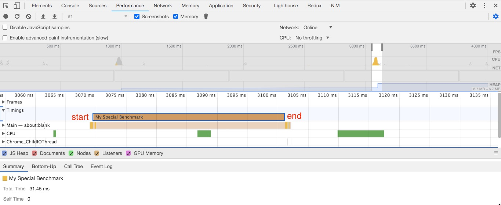

**[⬆ back to top](#table-of-contents)**

### Deoptimization, Deleting Properties

```javascript
performance.mark('start');

while (iterations--) {
  add(a, b);
}

// deoptimizing take place 
// input parameter type change to string
add('foo', 'bar');

performance.mark('end');

// node --trace-opt --trace-deopt benchmark.js | grep add

// [marking 0x369c1c1d2771 <JSFunction add (sfi = 0x369cf41cff51)> for optimized recompilation, reason: small function]
// [compiling method 0x369c1c1d2771 <JSFunction add (sfi = 0x369cf41cff51)> using TurboFan]
// [optimizing 0x369c1c1d2771 <JSFunction add (sfi = 0x369cf41cff51)> - took 0.469, 0.630, 0.010 ms]
// [completed optimizing 0x369c1c1d2771 <JSFunction add (sfi = 0x369cf41cff51)>]
//      13: 0x369c1c1d2771 ; rcx 0x369c1c1d2771 <JSFunction add (sfi = 0x369cf41cff51)>
//     0x7ffeefbfeb30: [top +  56] <- 0x369c1c1d2771 <JSFunction add (sfi = 0x369cf41cff51)> ;  stack parameter (input #13)
// [deoptimizing (DEOPT eager): begin 0x369c1c1d2771 <JSFunction add (sfi = 0x369cf41cff51)> (opt #0) @0, FP to SP delta: 24, caller sp: 0x7ffeefbfeb00]
//   reading input frame add => bytecode_offset=0, args=3, height=0, retval=0(#0); inputs:
//       0: 0x369c1c1d2771 ;  [fp -  16]  0x369c1c1d2771 <JSFunction add (sfi = 0x369cf41cff51)>
//   translating interpreted frame add => bytecode_offset=0, variable_frame_size=8, frame_size=80
//     0x7ffeefbfeac8: [top +  24] <- 0x369c1c1d2771 <JSFunction add (sfi = 0x369cf41cff51)> ;  function (input #0)
// [deoptimizing (eager): end 0x369c1c1d2771 <JSFunction add (sfi = 0x369cf41cff51)> @0 => node=0, pc=0x0001008d69a0, caller sp=0x7ffeefbfeb00, took 0.307 ms]
```

```javascript
performance.mark('start');

while (iterations--) {
  add(a, b);
}

iterations = 1e7;

while (iterations--) {
  add(a, b);
}

performance.mark('end');

// node benchmark.js

// PerformanceEntry {
//   name: 'My Special Benchmark',
//   entryType: 'measure',
//   startTime: 39.5916,
//   duration: 21.089114
// }
```

```javascript
performance.mark('start');

while (iterations--) {
  add(a, b);
}

// deoptimizing take place
// duration double from 21 to 46 ms
add('foo', 'bar');
iterations = 1e7;

while (iterations--) {
  add(a, b);
}

performance.mark('end');

// node benchmark.js

// PerformanceEntry {
//   name: 'My Special Benchmark',
//   entryType: 'measure',
//   startTime: 40.72167,
//   duration: 46.01813
// }
```

```javascript
performance.mark('start');

%NeverOptimizeFunction(add)

while (iterations--) {
  add(a, b);
}

performance.mark('end');

// node --allow-natives-syntax benchmark.js

// PerformanceEntry {
//   name: 'My Special Benchmark',
//   entryType: 'measure',
//   startTime: 52.143221,
//   duration: 187.299235
// }
```

```javascript
function add(x, y) {
  return x + y;
}

add(1, 2);
%OptimizeFunctionOnNextCall(add);
add(3, 4);

// node --allow-natives-syntax --trace-opt add.js

// [manually marking 0x2fc021127049 <JSFunction add (sfi = 0x2fc04320fc11)> for non-concurrent optimization]
// [compiling method 0x2fc021127049 <JSFunction add (sfi = 0x2fc04320fc11)> using TurboFan]
// [optimizing 0x2fc021127049 <JSFunction add (sfi = 0x2fc04320fc11)> - took 0.553, 0.504, 0.023 ms]
```

We use a system called speculative optimization.


How does this work?

- We use an interpreter because the optimizing compiler is slow to get started.
- Also: it needs some information before it knows what work it can either optimize or skip out on all together.
- So, the interpreter starts gathering feedback about what it sees as the function is used.

But what if a string slips in there?


The optimizing compiler optimizes for what it’s seen. If it sees something new, that’s problematic.

- add(1, 2) -> optimize -> add('foo', 'bar') -> deoptimize -> add(1, 2) -> optimize

```javascript
let iterations = 1000000;

class Point {
  constructor(x, y) {
    this.x = x;
    this.y = y;
  }
}

performance.mark('start');

while (iterations--) {
  const point = new Point(2, 4);
  JSON.stringify(point);
}

performance.mark('end');

// node benchmark.js

// PerformanceEntry {
//   name: 'My Special Benchmark',
//   entryType: 'measure',
//   startTime: 43.541689,
//   duration: 350.737282
// }
```

```javascript
performance.mark('start');

while (iterations--) {
  const point = new Point(2, 4);
  delete point.x;
  JSON.stringify(point);
}

performance.mark('end');

// node benchmark.js

// PerformanceEntry {
//   name: 'My Special Benchmark',
//   entryType: 'measure',
//   startTime: 40.989665,
//   duration: 734.314327
// }
```

```javascript
performance.mark('start');

while (iterations--) {
  const point = new Point(2, 4);
  delete point.y;
  JSON.stringify(point);
}

performance.mark('end');

// node benchmark.js

// PerformanceEntry {
//   name: 'My Special Benchmark',
//   entryType: 'measure',
//   startTime: 39.196188,
//   duration: 355.132393
// }
```

Conclusion: 
- Delete point.x increase execution time to 3x
- Delete point.y don't affect the execution time

**[⬆ back to top](#table-of-contents)**

### Deleting, Feeding Objects Exercise

```javascript
let iterations = 1000000;

class Point {
  constructor(x, y, z) {
    this.x = x;
    this.y = y;
    this.z = z;
  }
}

performance.mark('start');

while (iterations--) {
  const point = new Point(2, 4, 6);
  delete point.x;
  delete point.y;
  delete point.z;

  JSON.stringify(point);
}

performance.mark('end');
```

**[⬆ back to top](#table-of-contents)**

### Deleting, Feeding Objects Solution

```javascript
performance.mark('start');

while (iterations--) {
  const point = new Point(2, 4, 6);
  delete point.x;

  JSON.stringify(point);
}

performance.mark('end');

// node benchmark.js 

// PerformanceEntry {
//   name: 'My Special Benchmark',
//   entryType: 'measure',
//   startTime: 47.241762,
//   duration: 851.268479
// }
```

```javascript
performance.mark('start');

while (iterations--) {
  const point = new Point(2, 4, 6);
  delete point.y;

  JSON.stringify(point);
}

performance.mark('end');

// node benchmark.js 

// PerformanceEntry {
//   name: 'My Special Benchmark',
//   entryType: 'measure',
//   startTime: 43.362006,
//   duration: 971.586343
// }
```

```javascript
performance.mark('start');

while (iterations--) {
  const point = new Point(2, 4, 6);
  delete point.z;

  JSON.stringify(point);
}

performance.mark('end');

// node benchmark.js 

// PerformanceEntry {
//   name: 'My Special Benchmark',
//   entryType: 'measure',
//   startTime: 42.095334,
//   duration: 389.110982
// }
```

Conclusion: 
- Delete point.x and point.y increase execution time to 3x
- Delete point.z don't affect the execution time
- Delete last property don't affect the execution time

**[⬆ back to top](#table-of-contents)**

### Monomorphism, Polymorphism, and Megamorphism

```javascript
let iterations = 1e7;
const objects = [{ a: 1 }, { a: 2 }, { a: 3 }, { a: 4 }]

performance.mark('start');

while (iterations--) {
  let sum = 0;
  const obj = objects[iterations & 3];
  sum = sum + obj.a;
}

performance.mark('end');

// node benchmark.js 

// PerformanceEntry {
//   name: 'My Special Benchmark',
//   entryType: 'measure',
//   startTime: 43.635845,
//   duration: 17.738028
// }
```

```javascript
let iterations = 1e7;
const objects = [{ a: 1 }, { b: 1, a: 2 }, { a: 3, c: 4, b: 2 }, { a: 4, b: 7 }]

performance.mark('start');

while (iterations--) {
  let sum = 0;
  const obj = objects[iterations & 3];
  sum = sum + obj.a;
}

performance.mark('end');

// node benchmark.js 

// PerformanceEntry {
//   name: 'My Special Benchmark',
//   entryType: 'measure',
//   startTime: 41.509887,
//   duration: 24.452353
// }
```

Conclusion

- 40% increase in execution time when change from monomorphic to polymorphic, degree 3
```javascript
// monomorphic
const objects = [{ a: 1 }, { a: 2 }, { a: 3 }, { a: 4 }]
// polymorphic, degree 3
const objects = [{ a: 1 }, { b: 1, a: 2 }, { a: 3, c: 4, b: 2 }, { a: 4, b: 7 }]
```

*–morphism.

- Monomorphic: This is all I know and all that I’ve seen. I can get incredibly fast at this one thing.
- Polymorphic: I’ve seen a few shapes before. Let me just check to see which one and then I’ll go do the fast thing.
- Megamorphic: I’ve seen things. A lot of things. I’m not particularly specialized. Sorry.

So, how does the browser figure out what type something is?

- [JavaScript engine fundamentals: Shapes and Inline Caches](https://mathiasbynens.be/notes/shapes-ics)
- [What's up with monomorphism?](https://mrale.ph/blog/2015/01/11/whats-up-with-monomorphism.html)
- [V8 function optimization](https://erdem.pl/2019/08/v-8-function-optimization)
- [A Tour of Inline Caching with Delete](https://webkit.org/blog/10298/inline-caching-delete/)


```javascript
const obj1 = { x: 1 };  // monomorphic
const obj2 = { x: 2 };  // monomorphic
const obj3 = { x: 3 };  // monomorphic
const obj4 = { x: 3, y: 1 }; // polymorphic, degree 2
const obj5 = { x: 4, y: 1 }; // polymorphic, degree 2
const obj6 = { x: 5, z: 1 }; // polymorphic, degree 3
const obj7 = { x: 6, a: 1 }; // polymorphic, degree 4
const obj8 = { x: 7, b: 1 }; // megamorphic
```

Conclusion

- keep object shape to monomorphic [mono- ("one") + -morphic ("of a form")]

**[⬆ back to top](#table-of-contents)**

### Optimizing Objects

```javascript
const a = { a: 1 };
const b = { b: 1 };
console.log(%HaveSameMap(a, b));
// node --allow-natives-syntax classes.js
// false

const a = { a: 1 };
const b = { a: 1 };
console.log(%HaveSameMap(a, b));
// node --allow-natives-syntax classes.js
// true

const a = { a: 1, x: 3 };
const b = { a: 2 };
console.log(%HaveSameMap(a, b));
// node --allow-natives-syntax classes.js
// false

const a = { a: 1, x: 3 };
const b = { a: 2, x: 4 };
console.log(%HaveSameMap(a, b));
// node --allow-natives-syntax classes.js
// true

const a = { a: 1, x: 3 };
const b = { a: 2 };
b.x = 4;
console.log(%HaveSameMap(a, b));
// node --allow-natives-syntax classes.js
// false

const a = { a: 1 };
const b = { a: 2 };
a.x = 3;
b.x = 4;
console.log(%HaveSameMap(a, b));
// node --allow-natives-syntax classes.js
// true

const a = { a: 1 };
const b = Object.assign({}, a);
console.log(%HaveSameMap(a, b));
// node --allow-natives-syntax classes.js
// false

const a = { a: 1 };
const b = Object.assign({}, a);
const c = Object.assign({}, a);
console.log(%HaveSameMap(b, c));
// node --allow-natives-syntax classes.js
// true

class Point {
  constructor(x, y) {
    this.x = x;
    this.y = y;
  }
}
const a = new Point(1, 2);
const b = new Point(3, 4);
console.log(%HaveSameMap(a, b));
// node --allow-natives-syntax classes.js
// true
```

**[⬆ back to top](#table-of-contents)**

### Hidden Classes

Dynamic lookup: This object could be anything, so let me look at the rule book and figure this out.

Sure, computers are good at looking stuff up repeatedly, but they’re also good at remembering things.

It turns out there is a secret type system behind your back.


You can only move forward along the chain.


Okay, let’s look at this again with some real code.

**[⬆ back to top](#table-of-contents)**

### Scoping and Prototypes

```javascript
let iterations = 100000;

const test = () => {
  const add = point => point.x + point.y;
  class Point {
    constructor(x, y) {
      this.x = x;
      this.y = y;
    }
  }
  const point = new Point(10, 20);
  add(point);
};

performance.mark('start');

while (iterations--) {
  test();
}

performance.mark('end');

// node benchmark.js 
// PerformanceEntry {
//   name: 'My Special Benchmark',
//   entryType: 'measure',
//   startTime: 43.316833,
//   duration: 528.249334
// }
```

```javascript
let iterations = 100000;
class Point {
  constructor(x, y) {
    this.x = x;
    this.y = y;
  }
}

const test = () => {
  const add = point => point.x + point.y;
  const point = new Point(10, 20);
  add(point);
};

performance.mark('start');

while (iterations--) {
  test();
}

performance.mark('end');

// node benchmark.js 
// PerformanceEntry {
//   name: 'My Special Benchmark',
//   entryType: 'measure',
//   startTime: 41.143181,
//   duration: 6.36401
// }
```

Conclusion

- Must Point class out of test function results in 83x faster in execution.
- Why? See below code
- If Point class is inside the function makeAPoint, we are making this class as a different prototype chain every time.
- Each one of these output points point to a different type object when we make a fresh point function every time.

```javascript
const makeAPoint = () => {
  class Point {
    constructor(x, y) {
      this.x = x;
      this.y = y;
    }
  }
  return new Point(1, 2);
}

const a = makeAPoint();
const b = makeAPoint();
console.log(%HaveSameMap(a, b));
// node --allow-natives-syntax classes.js
// false
```
Takeaways

- Turbofan is able to optimize your code in substantial ways if you pass it consistent values.
- Initialize your properties at creation. 
- Initialize them in the same order.
- Try not to modify them after the fact.
- Maybe just use TypeScript or Flow so you don’t have to worry about these things?

**[⬆ back to top](#table-of-contents)**

### Function Inlining

Inline function
```javascript
const square = x => x * x;
const sumOfSquare = (a, b) => square(a) + square(b);
```

```javascript
let iterations = 100000;

const square = x => x * x;
const sumOfSquare = (a, b) => square(a) + square(b);

performance.mark('start');

while (iterations--) {
  sumOfSquare(iterations, iterations + 1);
}

performance.mark('end');

// node benchmark.js 
// PerformanceEntry {
//   name: 'My Special Benchmark',
//   entryType: 'measure',
//   startTime: 47.126163,
//   duration: 4.538562
// }
```

```javascript
let iterations = 100000;

const square = x => x * x;
const sumOfSquare = (a, b) => a * a + b * b;

performance.mark('start');

while (iterations--) {
  sumOfSquare(iterations, iterations + 1);
}

performance.mark('end');

// node benchmark.js 
// PerformanceEntry {
//   name: 'My Special Benchmark',
//   entryType: 'measure',
//   startTime: 42.331587,
//   duration: 3.977038
// }
```

```javascript
let iterations = 100000;

const square = x => x * x;
const sumOfSquare = (a, b) => square(a) + square(b);

performance.mark('start');

while (iterations--) {
  sumOfSquare(iterations, iterations + 1);
}

performance.mark('end');

// node --trace-turbo-inlining benchmark.js 
// 0x31ea001cff01 <SharedFunctionInfo square>: IsInlineable? true
// Inlining small function(s) at call site #29:JSCall
// Inlining 0x1040421b0 {0x31ea001cff01 <SharedFunctionInfo square>} into 0x10402b878 {0x31ea001cff51 <SharedFunctionInfo sumOfSquare>}
// 0x31ea001cff01 <SharedFunctionInfo square>: IsInlineable? true
// Inlining small function(s) at call site #43:JSCall
// Inlining 0x1040421b0 {0x31ea001cff01 <SharedFunctionInfo square>} into 0x10402b878 {0x31ea001cff51 <SharedFunctionInfo sumOfSquare>}
// 0x31eafcf49489 <SharedFunctionInfo Array>: IsInlineable? false (no Script associated with it)
// 0x31eafcf4a369 <SharedFunctionInfo Boolean>: IsInlineable? false (no Script associated with it)
// 0x31eafcf51f01 <SharedFunctionInfo BigInt>: IsInlineable? false (no Script associated with it)
// 0x31eafcf49f91 <SharedFunctionInfo Number>: IsInlineable? false (no Script associated with it)
// 0x31eafcf483e1 <SharedFunctionInfo Object>: IsInlineable? false (no Script associated with it)
// 0x31eafcf4c539 <SharedFunctionInfo Promise>: IsInlineable? false (no Script associated with it)
// 0x31eafcf4c6f9 <SharedFunctionInfo then>: IsInlineable? false (no Script associated with it)
// 0x31eafcf4a411 <SharedFunctionInfo String>: IsInlineable? false (no Script associated with it)
// 0x31eafcf4b2f1 <SharedFunctionInfo Symbol>: IsInlineable? false (no Script associated with it)
// 0x31eafcf4c921 <SharedFunctionInfo>: IsInlineable? false (no Script associated with it)
// 0x31eafcf4c809 <SharedFunctionInfo>: IsInlineable? false (no Script associated with it)
// 0x31eafcf4c7d1 <SharedFunctionInfo>: IsInlineable? false (no Script associated with it)
// 0x31eafcf4c8e9 <SharedFunctionInfo>: IsInlineable? false (no Script associated with it)
// 0x31eafcf4c9c9 <SharedFunctionInfo exec>: IsInlineable? false (no Script associated with it)
// 0x31ea001cff01 <SharedFunctionInfo square>: IsInlineable? true
// 0x31ea001cff51 <SharedFunctionInfo sumOfSquare>: IsInlineable? true
// 0x31ea001cff51 <SharedFunctionInfo sumOfSquare>: IsInlineable? true
// Inlining small function(s) at call site #54:JSCall
// Inlining 0x10481ceb8 {0x31ea001cff51 <SharedFunctionInfo sumOfSquare>} into 0x104814890 {0x31ea001cfde9 <SharedFunctionInfo>}
// 0x31ea001cff01 <SharedFunctionInfo square>: IsInlineable? true
// Inlining small function(s) at call site #91:JSCall
// Inlining 0x10481ea00 {0x31ea001cff01 <SharedFunctionInfo square>} into 0x104814890 {0x31ea001cfde9 <SharedFunctionInfo>}
// 0x31ea001cff01 <SharedFunctionInfo square>: IsInlineable? true
// Inlining small function(s) at call site #105:JSCall
// Inlining 0x10481ea00 {0x31ea001cff01 <SharedFunctionInfo square>} into 0x104814890 {0x31ea001cfde9 <SharedFunctionInfo>}
// 0x31eafcf49489 <SharedFunctionInfo Array>: IsInlineable? false (no Script associated with it)
// 0x31eafcf4a369 <SharedFunctionInfo Boolean>: IsInlineable? false (no Script associated with it)
// 0x31eafcf51f01 <SharedFunctionInfo BigInt>: IsInlineable? false (no Script associated with it)
// 0x31eafcf49f91 <SharedFunctionInfo Number>: IsInlineable? false (no Script associated with it)
// 0x31eafcf483e1 <SharedFunctionInfo Object>: IsInlineable? false (no Script associated with it)
// 0x31eafcf4c539 <SharedFunctionInfo Promise>: IsInlineable? false (no Script associated with it)
// 0x31eafcf4c6f9 <SharedFunctionInfo then>: IsInlineable? false (no Script associated with it)
// 0x31eafcf4a411 <SharedFunctionInfo String>: IsInlineable? false (no Script associated with it)
// 0x31eafcf4b2f1 <SharedFunctionInfo Symbol>: IsInlineable? false (no Script associated with it)
// (base) Chesters-MacBook-Pro:benchmarks chesterheng$ node --trace-turbo-inlining benchmark.js 
// 0x3372a2bcff01 <SharedFunctionInfo square>: IsInlineable? true
// Inlining small function(s) at call site #29:JSCall
// Inlining 0x1048599b0 {0x3372a2bcff01 <SharedFunctionInfo square>} into 0x10484b678 {0x3372a2bcff51 <SharedFunctionInfo sumOfSquare>}
// 0x3372a2bcff01 <SharedFunctionInfo square>: IsInlineable? true
// Inlining small function(s) at call site #43:JSCall
// Inlining 0x1048599b0 {0x3372a2bcff01 <SharedFunctionInfo square>} into 0x10484b678 {0x3372a2bcff51 <SharedFunctionInfo sumOfSquare>}
// 0x337265a09489 <SharedFunctionInfo Array>: IsInlineable? false (no Script associated with it)
// 0x337265a0a369 <SharedFunctionInfo Boolean>: IsInlineable? false (no Script associated with it)
// 0x337265a11f01 <SharedFunctionInfo BigInt>: IsInlineable? false (no Script associated with it)
// 0x337265a09f91 <SharedFunctionInfo Number>: IsInlineable? false (no Script associated with it)
// 0x337265a083e1 <SharedFunctionInfo Object>: IsInlineable? false (no Script associated with it)
// 0x337265a0c539 <SharedFunctionInfo Promise>: IsInlineable? false (no Script associated with it)
// 0x337265a0c6f9 <SharedFunctionInfo then>: IsInlineable? false (no Script associated with it)
// 0x337265a0a411 <SharedFunctionInfo String>: IsInlineable? false (no Script associated with it)
// 0x337265a0b2f1 <SharedFunctionInfo Symbol>: IsInlineable? false (no Script associated with it)
// 0x337265a0c921 <SharedFunctionInfo>: IsInlineable? false (no Script associated with it)
// 0x337265a0c809 <SharedFunctionInfo>: IsInlineable? false (no Script associated with it)
// 0x337265a0c7d1 <SharedFunctionInfo>: IsInlineable? false (no Script associated with it)
// 0x337265a0c8e9 <SharedFunctionInfo>: IsInlineable? false (no Script associated with it)
// 0x337265a0c9c9 <SharedFunctionInfo exec>: IsInlineable? false (no Script associated with it)
// 0x3372a2bcff01 <SharedFunctionInfo square>: IsInlineable? true
// 0x3372a2bcff51 <SharedFunctionInfo sumOfSquare>: IsInlineable? true
// 0x3372a2bcff51 <SharedFunctionInfo sumOfSquare>: IsInlineable? true
// Inlining small function(s) at call site #54:JSCall
// Inlining 0x10485b6b8 {0x3372a2bcff51 <SharedFunctionInfo sumOfSquare>} into 0x10484b690 {0x3372a2bcfde9 <SharedFunctionInfo>}
// 0x3372a2bcff01 <SharedFunctionInfo square>: IsInlineable? true
// Inlining small function(s) at call site #91:JSCall
// Inlining 0x10485d200 {0x3372a2bcff01 <SharedFunctionInfo square>} into 0x10484b690 {0x3372a2bcfde9 <SharedFunctionInfo>}
// 0x3372a2bcff01 <SharedFunctionInfo square>: IsInlineable? true
// Inlining small function(s) at call site #105:JSCall
// Inlining 0x10485d200 {0x3372a2bcff01 <SharedFunctionInfo square>} into 0x10484b690 {0x3372a2bcfde9 <SharedFunctionInfo>}
// 0x337265a09489 <SharedFunctionInfo Array>: IsInlineable? false (no Script associated with it)
// 0x337265a0a369 <SharedFunctionInfo Boolean>: IsInlineable? false (no Script associated with it)
// 0x337265a11f01 <SharedFunctionInfo BigInt>: IsInlineable? false (no Script associated with it)
// 0x337265a09f91 <SharedFunctionInfo Number>: IsInlineable? false (no Script associated with it)
// 0x337265a083e1 <SharedFunctionInfo Object>: IsInlineable? false (no Script associated with it)
// 0x337265a0c539 <SharedFunctionInfo Promise>: IsInlineable? false (no Script associated with it)
// 0x337265a0c6f9 <SharedFunctionInfo then>: IsInlineable? false (no Script associated with it)
// 0x337265a0a411 <SharedFunctionInfo String>: IsInlineable? false (no Script associated with it)
// 0x337265a0b2f1 <SharedFunctionInfo Symbol>: IsInlineable? false (no Script associated with it)
// 0x337265a0c921 <SharedFunctionInfo>: IsInlineable? false (no Script associated with it)
// 0x337265a0c809 <SharedFunctionInfo>: IsInlineable? false (no Script associated with it)
// 0x337265a0c7d1 <SharedFunctionInfo>: IsInlineable? false (no Script associated with it)
// 0x337265a0c8e9 <SharedFunctionInfo>: IsInlineable? false (no Script associated with it)
// 0x337265a0c9c9 <SharedFunctionInfo exec>: IsInlineable? false (no Script associated with it)
// 0x3372a2bcff01 <SharedFunctionInfo square>: IsInlineable? true
// 0x3372a2bcfde9 <SharedFunctionInfo>: IsInlineable? true
// 0x3372a2bcff51 <SharedFunctionInfo sumOfSquare>: IsInlineable? true
// PerformanceEntry {
//   name: 'My Special Benchmark',
//   entryType: 'measure',
//   startTime: 50.797892,
//   duration: 9.871933
// }
```

**[⬆ back to top](#table-of-contents)**

### JavaScript Performance Takeaways

- The easiest way to reduce parse, compile, and execution times is to ship less code.
- Use the User Timing API to figure out where the biggest amount of hurt is.
- Consider using a type system so that you don’t have to think about all of the stuff I just talked about.

**[⬆ back to top](#table-of-contents)**

## **03. Rendering Performance**

### How Web Pages Are Built


The Render Tree

- The Render Tree has a one-to-one mapping with the visible objects on the page.
  - So, not hidden object.
  - Yes, to pseudo elements (e.g. :after, :before).
- There might be multiple rules that apply to a single element. We need to figure that all out here.

Style calculation: The browser figures out all of the styles that will be applied to a given element.

This involves two things:

- Figuring out which rules apply to which elements.
- Figuring out how what the end result of an element with multiple rules is.

Styling Elements: Selector Matching

- This is the process of figuring out what styles apply to an element.
- The more complicated you get, the longer this takes.

- Class names are super simple.
- Free Advice: Stick to simple class names whenever possible. Consider using BEM.
- Browsers read selectors from right to left.
- The less selectors you use, this faster this is going to be.

Takeaways

- Use simple selectors whenever possible.
  - Consider using BEM or some other system.
- Reduce the effected elements.
  - This is really a way to get to the first one.
  - A little bit of code—either on the server or the client— can go a long way.

Styling Elements: Calculating Render Styles

- Selector matching tries to figure out what selectors apply to an element.
- When multiple selectors apply to an element. The browser needs to figure out who wins.
- The easiest way to make this faster is to not do it.
- Free Advice (again): Stick to simple class names whenever possible. Consider using BEM.
- A quick note on style invalidation: It doesn’t matter as much in newer browsers.

Some Takeaways

- Reduce the number of styles that effect a given element.
- The less styles you have, the less there is to check.
- Reduce the amount of unused CSS that you’re shipping.

Layout (a.k.a Reflow): Look at the elements and figure out where they go on the page.

Paint: We know what things should look like and where they should go. Draw some pixels to the screen.

Composite Layers: You might end up painting on multiple layers, but you’ll eventually need to combine them.

Profit. 💸

**[⬆ back to top](#table-of-contents)**

### JavaScript and the Render Pipeline

JavaScript gives you the ability to change all of this after the initial load, which means you might have to do all of the above again.

Things JavaScript can do: An incomplete list

- Change the class on an object.
- Change the inline styles on an object. 
- Add or remove elements from the page.

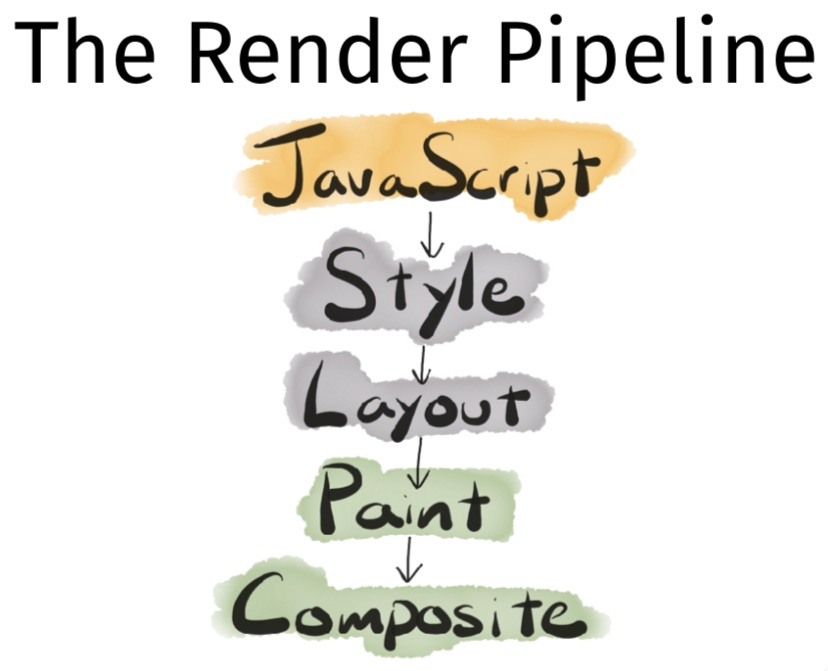

Okay, so let’s say you change a class or inline style on an element.

The computed styles could have changed—so, we better recalculate those and rebuild the render tree.

That may or may not have changed the geometry of the objects. We should probably re-layout the page.

Things are different. I guess we need to paint some new images.

Send those images off to the GPU to be composited.

To be clear: You don’t need to do all of these things every time.

And, that’s what this is about.

Reminder: Steve’s golden rule of performance.

**[⬆ back to top](#table-of-contents)**

### Layouts and Reflows

Reflows are very expensive in terms of performance, and is one of the main causes of slow DOM scripts, especially on devices with low processing power, such as phones. In many cases, they are equivalent to laying out the entire page again. —Opera

Whenever the geometry of an element changes, the browser has to reflow the page.

Browser implementations have different ways of optimizing this, so there is no point sweating the details in this case.

Tasting Notes

- A reflow is a blocking operation. Everything else stops. 
- It consumes a decent amount of CPU.
- It will definitely be noticeable by the user if it happens often (e.g. in a loop).

A reflow of an element causes a reflow of its parents and children.

Okay, so what causes a reflow?

- Resizing the window
- Changing the font
- Content changes
- Adding or removing a stylesheet
- Adding or removing classes 
- Adding or removing elements 
- Changing orientation 
- Calculating size or position
- Changing size or position
- Even more...

Generally speaking, a reflow is followed by a repaint, which is also expensive.

How can you avoid reflows?

- Change classes at the lowest levels of the DOM tree.
- Avoid repeatedly modifying inline styles.
- Trade smoothness for speed if you’re doing an animation in JavaScript. 
- Avoid table layouts.
- Batch DOM manipulation.
- Debounce window resize events.

**[⬆ back to top](#table-of-contents)**

### Layouts and Reflows Exercise

https://codepen.io/stevekinney/full/eVadLB/

```html
<button id="double-sizes">Double Sizes</button>

<section id="boxes">
  <div class="box" style="width: 20px;"></div>
  <div class="box" style="width: 5px;"></div>
  <div class="box" style="width: 16px;"></div>
  <div class="box" style="width: 5px;"></div>
  <div class="box" style="width: 4px;"></div>
  <div class="box" style="width: 7px;"></div>
  <div class="box" style="width: 7px;"></div>
  <div class="box" style="width: 7px;"></div>
  <div class="box" style="width: 11px;"></div>
  <div class="box" style="width: 15px;"></div>
  <div class="box" style="width: 4px;"></div>
  <div class="box" style="width: 13px;"></div>
  <div class="box" style="width: 4px;"></div>
  <div class="box" style="width: 25px;"></div>
  <div class="box" style="width: 11px;"></div>
  <div class="box" style="width: 15px;"></div>
  <div class="box" style="width: 6px;"></div>
  <div class="box" style="width: 20px;"></div>
  <div class="box" style="width: 1px;"></div>
  <div class="box" style="width: 3px;"></div>
  <div class="box" style="width: 10px;"></div>
  <div class="box" style="width: 12px;"></div>
  <div class="box" style="width: 11px;"></div>
  <div class="box" style="width: 24px;"></div>
  <div class="box" style="width: 3px;"></div>
  <div class="box" style="width: 6px;"></div>
  <div class="box" style="width: 25px;"></div>
  <div class="box" style="width: 23px;"></div>
  <div class="box" style="width: 18px;"></div>
  <div class="box" style="width: 3px;"></div>
  <div class="box" style="width: 23px;"></div>
  <div class="box" style="width: 16px;"></div>
  <div class="box" style="width: 10px;"></div>
  <div class="box" style="width: 5px;"></div>
  <div class="box" style="width: 14px;"></div>
  <div class="box" style="width: 15px;"></div>
  <div class="box" style="width: 25px;"></div>
  <div class="box" style="width: 21px;"></div>
  <div class="box" style="width: 1px;"></div>
  <div class="box" style="width: 6px;"></div>
  <div class="box" style="width: 12px;"></div>
  <div class="box" style="width: 1px;"></div>
  <div class="box" style="width: 9px;"></div>
  <div class="box" style="width: 18px;"></div>
  <div class="box" style="width: 3px;"></div>
  <div class="box" style="width: 17px;"></div>
  <div class="box" style="width: 13px;"></div>
  <div class="box" style="width: 22px;"></div>
  <div class="box" style="width: 2px;"></div>
  <div class="box" style="width: 18px;"></div>
  <div class="box" style="width: 13px;"></div>
  <div class="box" style="width: 1px;"></div>
  <div class="box" style="width: 4px;"></div>
  <div class="box" style="width: 0px;"></div>
  <div class="box" style="width: 18px;"></div>
  <div class="box" style="width: 14px;"></div>
  <div class="box" style="width: 22px;"></div>
  <div class="box" style="width: 19px;"></div>
  <div class="box" style="width: 20px;"></div>
  <div class="box" style="width: 13px;"></div>
  <div class="box" style="width: 18px;"></div>
  <div class="box" style="width: 17px;"></div>
  <div class="box" style="width: 23px;"></div>
  <div class="box" style="width: 2px;"></div>
  <div class="box" style="width: 2px;"></div>
  <div class="box" style="width: 9px;"></div>
  <div class="box" style="width: 15px;"></div>
  <div class="box" style="width: 18px;"></div>
  <div class="box" style="width: 1px;"></div>
  <div class="box" style="width: 3px;"></div>
  <div class="box" style="width: 14px;"></div>
  <div class="box" style="width: 23px;"></div>
  <div class="box" style="width: 13px;"></div>
  <div class="box" style="width: 20px;"></div>
  <div class="box" style="width: 25px;"></div>
  <div class="box" style="width: 2px;"></div>
  <div class="box" style="width: 1px;"></div>
  <div class="box" style="width: 11px;"></div>
  <div class="box" style="width: 7px;"></div>
  <div class="box" style="width: 16px;"></div>
  <div class="box" style="width: 9px;"></div>
  <div class="box" style="width: 12px;"></div>
  <div class="box" style="width: 15px;"></div>
  <div class="box" style="width: 15px;"></div>
  <div class="box" style="width: 6px;"></div>
  <div class="box" style="width: 4px;"></div>
  <div class="box" style="width: 1px;"></div>
  <div class="box" style="width: 11px;"></div>
  <div class="box" style="width: 5px;"></div>
  <div class="box" style="width: 16px;"></div>
  <div class="box" style="width: 0px;"></div>
  <div class="box" style="width: 5px;"></div>
  <div class="box" style="width: 2px;"></div>
  <div class="box" style="width: 8px;"></div>
  <div class="box" style="width: 2px;"></div>
  <div class="box" style="width: 17px;"></div>
  <div class="box" style="width: 25px;"></div>
  <div class="box" style="width: 16px;"></div>
  <div class="box" style="width: 11px;"></div>
  <div class="box" style="width: 17px;"></div>
</section>
```

```scss
#boxes {
  margin: 1em 0;
}

.box {
  background-color: black;
  height: 20px;
}
```

**[⬆ back to top](#table-of-contents)**

### Layouts and Reflows Solution

https://codepen.io/chesterheng/full/MWyBBxQ


```javascript
const button = document.getElementById('double-sizes');
const boxes = Array.from(document.querySelectorAll('.box'));

const doubleWidth = element => {
  // check each width and adjust width
  const width = element.offsetWidth;
  element.style.width = `${width * 2}px`;
}

button.addEventListener('click', (event) => {
  boxes.forEach(doubleWidth);
});
```

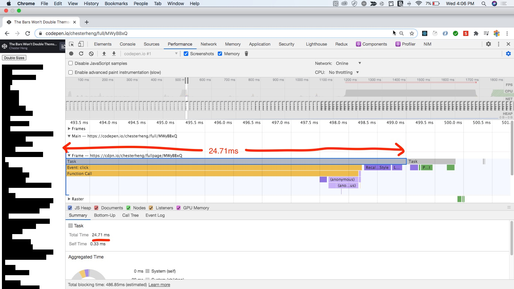

```javascript
const button = document.getElementById('double-sizes');
const boxes = Array.from(document.querySelectorAll('.box'));

button.addEventListener('click', (event) => {
  // get all widths
  const widths = boxes.map(element => element.offsetWidth)
  // asjust all widths
  boxes.forEach((element, index) => {
    element.style.width = `${widths[index] * 2}px`;
  })
});
```

Conclusion: 

- Layout and painting is the most expensive operations
- Do not get one width and adjust one width (layout) and repeat
  - Result in browswer recalculate style -> layout -> recalculate style -> layout -> repeat
  - Result in Layout Thrashing
- Apply batch DOM manipulation
  - Get all widths first then adjust all widths (layout)
  - Layout only once and time is redux by half

**[⬆ back to top](#table-of-contents)**

### Layout Thrashing

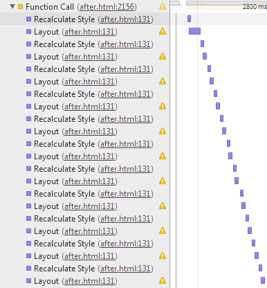

Less cool names: Forced synchronous layout.

There are a set of things you can do that cause the browser to stop what it’s doing and calculate style and layout.

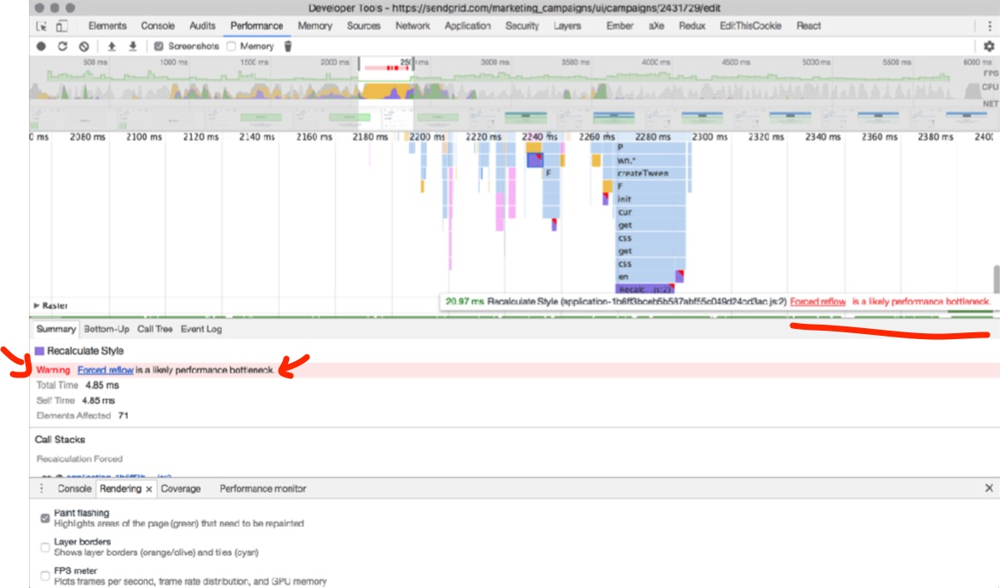

Layout Thrashing occurs when JavaScript violently writes, then reads, from the DOM, multiple times causing document reflows. —Winston Page

`const height = element.offsetHeight;`

The browser wants to get you the most up to date answer, so it goes and does a style and layout check.

```javascript
// recalculate style -> layout -> repeat
firstElement.classList.toggle('bigger');  // Change!
const firstElementWidth = firstElement.width;  // Calculate
secondElement.classList.toggle('bigger');  // Change!
const secondElementWidth = secondElement.width;  // Calculate
```

- The browser knew it was going to have to change stuff after that first line.
- Then you went ahead and asked it for some information about the geometry of another object.
- So, it stopped your JavaScript and reflowed the page in order to get you an answer.

Solution: Separate reading from writing.

```javascript
firstElement.classList.toggle('bigger');  // Change!
secondElement.classList.toggle('bigger');  // Change!
const firstElementWidth = firstElement.width;  // Calculate
const secondElementWidth = secondElement.width; // 🏖
```

**[⬆ back to top](#table-of-contents)**

### Solving for Layout Trashing

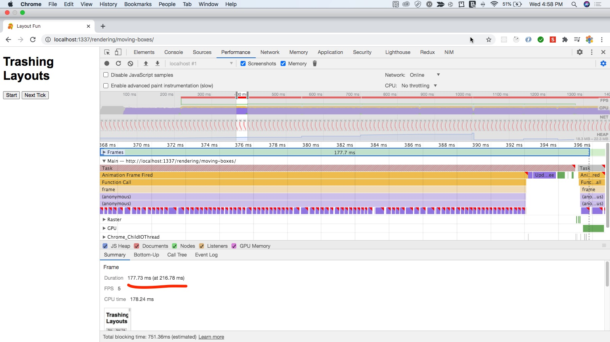

```javascript
registerNextClick(function (timestamp) {
  elements.forEach((element, index) => {
    const top = element.offsetTop;
    const nextPosition = +((Math.sin(top + timestamp/1000) + 1) / 2 * containerWidth);
    element.style.transform = `translateX(${nextPosition}px)`;
  });
});
```

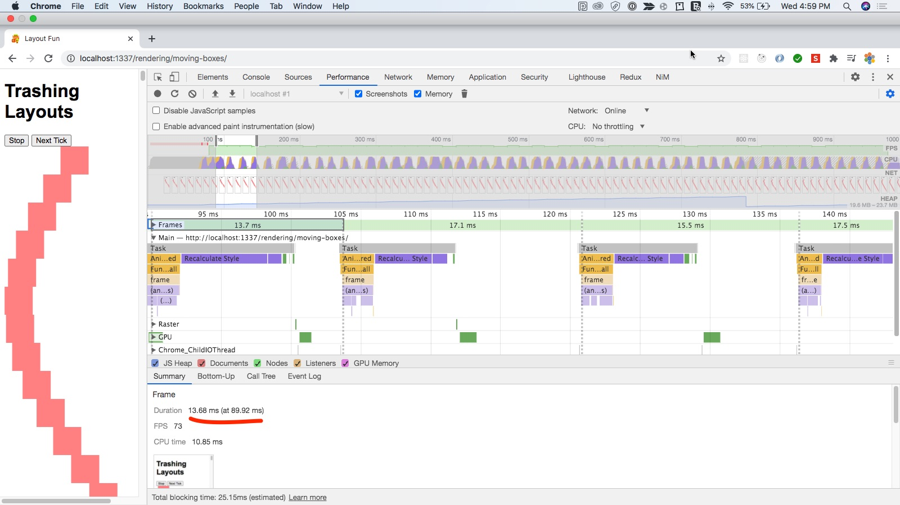

```javascript
registerNextClick(function (timestamp) {
  const nextPositions = elements.map(element => {
    const top = element.offsetTop;
    const nextPosition = +((Math.sin(top + timestamp/1000) + 1) / 2 * containerWidth);
    return nextPosition;
  })
  
  elements.forEach((element, index) => {
    const nextPosition = nextPositions[index];
    element.style.transform = `translateX(${nextPosition}px)`;
  });
});
```

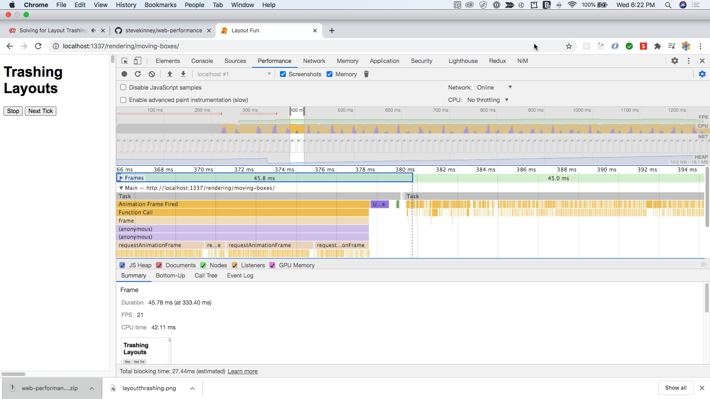

```javascript
registerNextClick(function (timestamp) {
  elements.forEach((element, index) => {
    const top = element.offsetTop;
    const nextPosition = +((Math.sin(top + timestamp/1000) + 1) / 2 * containerWidth);
    requestAnimationFrame(() => {
      element.style.transform = `translateX(${nextPosition}px)`;
    })
  });
});
```

**[⬆ back to top](#table-of-contents)**

### FastDOM

It sounds like we could use a better abstraction, right?

[fastdom](https://github.com/wilsonpage/fastdom)

```javascript
fastdom.measure(()  => {
  // read data
  fastdom.mutate(()  => {
    // update layout
  });
});
```

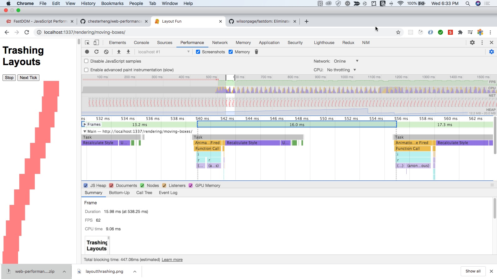

```javascript
registerNextClick(function (timestamp) {
  elements.forEach((element, index) => {
    fastdom.measure(()  => {
      const top = element.offsetTop;
      const nextPosition = +((Math.sin(top + timestamp/1000) + 1) / 2 * containerWidth);
      fastdom.mutate(() => {
        element.style.transform = `translateX(${nextPosition}px)`;
      })
    });
  });
});
```

**[⬆ back to top](#table-of-contents)**

### FastDOM Exercise

https://codepen.io/stevekinney/full/eVadLB

**[⬆ back to top](#table-of-contents)**

### FastDOM Solution


```javascript
const button = document.getElementById('double-sizes');
const boxes = Array.from(document.querySelectorAll('.box'));

const doubleWidth = element => {
  // check each width and adjust width
  const width = element.offsetWidth;
  element.style.width = `${width * 2}px`;
}

button.addEventListener('click', (event) => {
  boxes.forEach(doubleWidth);
});
```

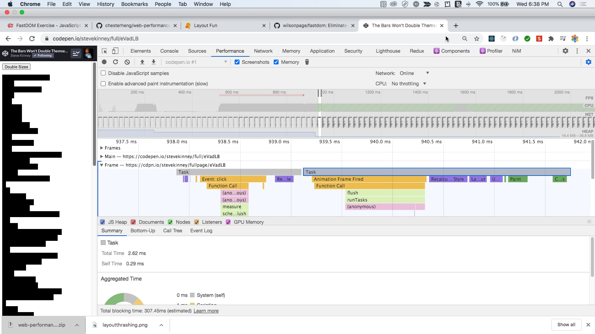

```javascript
const button = document.getElementById('double-sizes');
const boxes = Array.from(document.querySelectorAll('.box'));

button.addEventListener('click', (event) => {
  boxes.forEach((element, index) => {
    fastdom.measure(() => {
      const width = element.offsetWidth;
      fastdom.mutate(() => {
        element.style.width = `${width * 2}px`;
      })
    });
  })
});
```

**[⬆ back to top](#table-of-contents)**

### Frameworks and Layout Thrashing

React to the rescue?

```javascript
class App extends Component {
  state = { widths: [50, 100, 150], }
  
  doubleSize = ()  => {
    const widths = this.state.widths.map(n  => n * 2);
    this.setState({ widths });
  };

  render() {
    const [firstWidth, secondWidth, thirdWidth] = this.state.widths;
    return (
      <div>
        <button onClick={this.doubleSize}>Double Sizes</button>
        <div style={{ width: firstWidth }}  />
        <div style={{ width: secondWidth }}  />
        <div style={{ width: thirdWidth }}  />
      </div>
    );
  }
}
```

Friendly fact: Production mode is important in React!

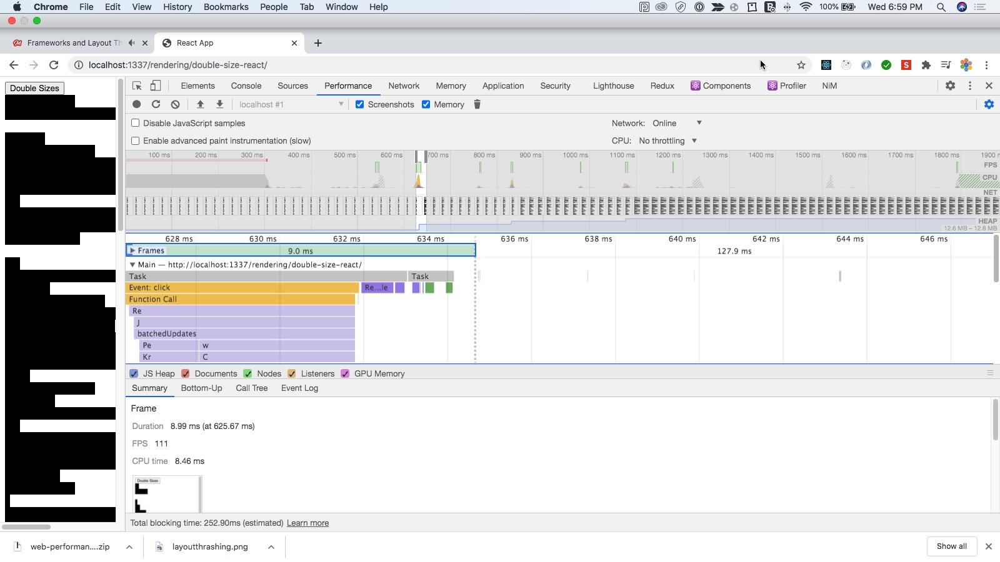

Some Takeaways

- Don’t mix reading layout properties and writing them— you’ll do unnecessary work.
- If you can change the visual appearance of an element by adding a CSS class. Do that, you’ll avoid accidental trashing.
- Storing data in memory—as opposed to the DOM—means we don’t have to check the DOM.
- Frameworks come with a certain amount of overhead.
- You don’t need to use a framework to take advantage of this. 
- You can do bad things even if you use a framework.
- You may not know you’re layout thrashing—so, measure!

**[⬆ back to top](#table-of-contents)**

### Painting

Painting, Layers, the Profiling Thereof

Anytime you change something other than opacity or a CSS transform... you’re going to trigger a paint.

When we do a paint, the browser tells every element on the page to draw a picture of itself.

It has all of this information form when we constructed the render tree and did the layout.

Triggering a layout will always trigger a paint.

But, if you’re just changing colors or something—then you don’t need to do a reflow. Just a repaint.

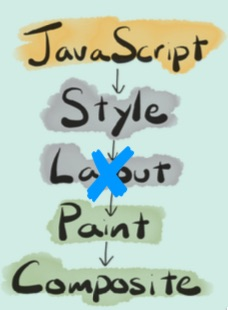

Use your `Paint flashing` tools to see if you’re painting.

Rule of Thumb: Paint as much as you need and as little as you can get away with.

**[⬆ back to top](#table-of-contents)**

### The Compositor Thread

Browser threads 

- The UI thread: Chrome itself. The tab bar, etc.
- The Renderer thread: We usually call this the main thread. This is where all JavaScript, parsing HTML and CSS, style calculation, layout, and painting happens. There are one of these per tab. One tab has one on thread.
- The Compositor Thread: Draws bitmaps to the screen via the GPU

The Compositor Thread

- When we paint, we create bitmaps for the elements, put them onto layers, and prepare shaders for animations if necessary.
- After painting, the bitmaps are shared with a thread on the GPU to do the actual compositing.
- The GPU process works with OpenGL to make magic happen on your screen.

The Main Thread is CPU-intensive.
The Compositor Thread is GPU-intensive.

It can go off and work on some super hard JavaScript computation and the animations will still chug along.

This is cool, because it frees up the main thread to do all of the work it’s responsible for.

**[⬆ back to top](#table-of-contents)**

### Managing Layers

Again: Painting is super expensive and you should avoid it whenever possible.

But, Steve—how do I avoid painting? Isn’t that just a fact of life when it comes to getting pixels on the screen? —Your inner monologue

““Let the Compositor Thread handle this stuff!” — Me, in response

Things the compositor thread is really good at:

- Drawing the same bitmaps over and over in different places.
- Scaling and rotating bitmaps. 
- Making bitmaps transparent. 
- Applying filters.
- Mining Bitcoin.

If you want to be fast, then offload whatever you can to the less-busy thread.

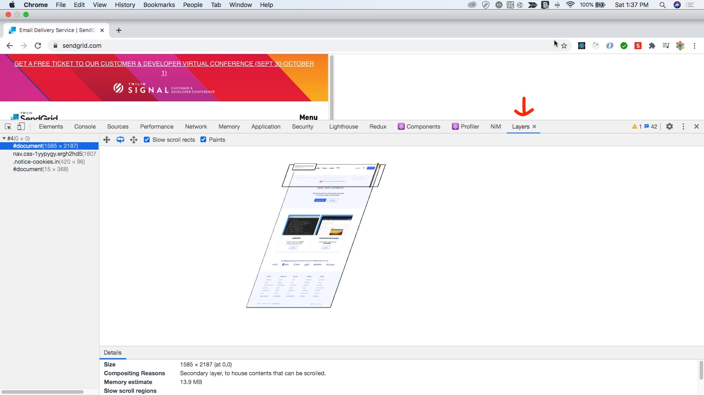

Disclaimer: Compositing is kind of a hack.

One does not simply use layers

Layers are an optimization that the browser does for you under the hood.

What kind of stuff gets its own layer?

- The root object of the page.
- Objects that have specific CSS positions. 
- Objects with CSS transforms.
- Objects that have overflow.
- (Other stuff...)

Objects that don’t fall under one of these reasons will be on the same element as the last one that did.

**[⬆ back to top](#table-of-contents)**

### will-change

(Hint: The root object is always its own layer.)

You can give the browser hints using the will-change property.

```javascript
.sidebar {
  will-change: transform;
}
```

https://caniuse.com/?search=will-change

```javascript
.sidebar {
  transform: translateZ(0);
}

.sidebar {
  will-change: transform;
}
```

Play Time

```javascript
header {
  will-change: transform;
}

footer {
  will-change: transform;
}
```

Using layers is a trade off.

Managing layers takes a certain amount of work on the browser’s behalf.

Each layer needs to be kept in the shared memory between the main and composite threads.

```javascript
// This is a terrible idea.
* {
  will-change: transform;
}
```

The browser is already trying to help you out under the hood.

Pro Tip: will-change is for things that will change. (Not things that are changing.)

Promoting an object to its own layer takes a non-zero amount of time.

```javascript
// Not really useful
.sidebar.is-opening {
  will-change: transform;
  transition: transform 0.5s;
  transform: translate(400px);
}
```

```javascript
// More useful. promote to layer before action is taken
.sidebar {
  will-change: transform;
  transition: transform 0.5s;
}

.sidebar:hover {
  will-change: transform;
}

.sidebar.open {
  transform: translate(400px);
}
```

**[⬆ back to top](#table-of-contents)**

### Applying will-change with JavaScript

will-change is tricky because while it’s a CSS property, you’ll typically access it using JavaScript.

```javascript
element.addEventListener('mouseenter', ()  => {
  element.style.willChange = 'transform';
});
```

If it’s something that the user is interacting with constantly, add it to the CSS. Otherwise, do it with JavaScript.

Clean up after yourself. Remove will- change when it’s not going to change anymore.

```javascript
element.addEventListener('mouseenter', ()  => {
  element.style.willChange = 'transform';
});

element.addEventListener('animationEnd', ()  => {
  element.style.willChange = 'auto';
});
```

**[⬆ back to top](#table-of-contents)**

### will-change Exercise

- Let’s look at the “Paint Storming” example. 
- Don’t be surprised if you find a paint storm.
- Can you swap out that jQuery animation for a CSS transition?
- Can you put the will-change on before the transition? 
- Can you remove it after?

**[⬆ back to top](#table-of-contents)**

### will-change Solution

```javascript
const box = document.querySelector('.box');

box.addEventListener('mouseenter', () => {
  box.style.willChange = 'transform';
});

box.addEventListener('mouseleave', () => {
  box.style.willChange = 'auto';
});

box.addEventListener('transitioned', () => {
  box.style.willChange = 'auto';
});

box.addEventListener('click', () => {
  box.classList.toggle('move');
});
```

**[⬆ back to top](#table-of-contents)**

## **04. Load Performance**

### Latency and Bandwidth

A Journey of Self-Discovery

“Networks, CPUs, and disks all hate you. On the client, you pay for what you send in ways you can't easily see. —Alex Russell

Bandwidth vs. Latency

- Bandwidth is how much stuff you can fit through the tube per second.
- Latency is how long it takes to get to the other end of the tube.

[Front End Center — Why Latency Matters: Foundations of Web Performance](https://www.youtube.com/watch?v=ak4EZQB4Ylg)

TCP focuses on reliability

- We keep checking in with the server to make sure that everything is going well.
- Packets are delivered in the correct order. 
- Packets are delivered without errors. 
- Client acknowledges each packet. 
- Unreliable connections are handled well. 
- Will not overload the network.

TCP starts by sending a small amount of data and then starts sending more and more as we find out that things are being successful.

Fun fact: This is why things feel so much worse on a slow Internet connection.

Pro tip: The initial window size is 14kb. So, if you can get files under 14kb, then it means you can get everything through in the first window. Very cool.

[Lab](http://www.cloudping.info/)

Hmm... So, where is the optimal place to put our assets?

Answer: Everywhere.

[Amazon CloudFront Infrastructure](https://aws.amazon.com/cloudfront/features/)

**[⬆ back to top](#table-of-contents)**

### Caching

HTTP/1.1 added the Cache- Control response header.

Caching only affects the "safe" HTTP methods.

- GET
- OPTIONS
- HEAD

It doesn’t support ... because how would it?

- PUT
- POST
- DELETE
- PATCH

Cache-Control headers
- no-store
- no-cache
- max-age
- s-maxage
- immutable

Three over-simplified possibilities

- Cache Missing: There is no local copy in the cache.
- Stale: Do a Conditional GET. The browser has a copy but it's
old and no longer valid. Go get a new version.
- Valid: We have a thing in cache and its good—so, don't even bother talking to the server.

```javascript
const express = require('express');
const serveStatic = require('serve-static');

const app = express();
app.use(serveStatic( __dirname, {
  setHeaders(response, path) {
  response.setHeader('Cache-Control', 'no-store');
 }
}));

const port = process.env.port  || 3000;
app.listen(post, () => console.log(`⚓ Ahoy! The server is listening on port ${port}!`));
```

- no-store: The browser gets a new version every time.
- no-cache: This means you can store a copy, but you can't use it without checking with the server.
- max-age: Tell the browser not to bother if whatever asset it has is less than a certain number of seconds old.

Caching is great unless you mess it up.

We can say "Yo, cache this for a long time!"
But, what if we ship some bunk assets? Oh no.

How the will the user know to do a hard refresh to get the new ones?

Another solution: Content-Addressable Storage
- `main.567eea7aa72b3ee48649.js`

Caching for CDNs

CDNs respect the max-age header just like browsers. But this opens up a new can of worms.
- We want CSS and JavaScripts to be cached by the browser.
- We would like the CDN to cache the HTML that it serves up. But we don't want the browser to (because that ends us up in our earlier problem).

s-maxage is for CDNs only. Tell the CDN to keep it forever. But don't tell the browser to do it.

To reiterate: We have no way to reach into all of our customers browsers and tell them to purge their caches of our assets, but we can tell the CDN to.

**[⬆ back to top](#table-of-contents)**

### Service Workers
**[⬆ back to top](#table-of-contents)**

### Lazy Loading
**[⬆ back to top](#table-of-contents)**

### Lazy Loading Demonstrations
**[⬆ back to top](#table-of-contents)**

### Analyzing Bundle Sizes
**[⬆ back to top](#table-of-contents)**

### Slimming Dependencies
**[⬆ back to top](#table-of-contents)**

### Lazy Loading components with React-Loadable
**[⬆ back to top](#table-of-contents)**

### Component Lazy Loading Exercise
**[⬆ back to top](#table-of-contents)**

### Component Lazy Loading Solution
**[⬆ back to top](#table-of-contents)**

### HTTP/2
**[⬆ back to top](#table-of-contents)**

## **05. Tools**
**[⬆ back to top](#table-of-contents)**

## **06. Wrapping Up**
**[⬆ back to top](#table-of-contents)**
